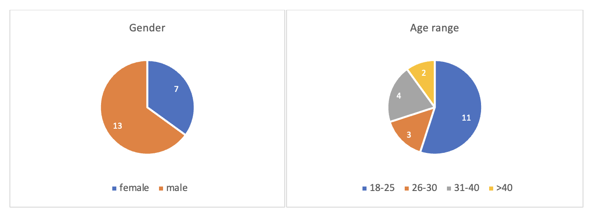

# Background

## Table of contents

- [Abstract](#jump1)

- [Objectives](#jump2)

- [Architecture and design](#jump3)

- [Full description of all features](#jump4)

## Abstract

Coronavirus remains a serious health risk.[1] Bristol’s current rate of infection is 415 cases per 100,000 population, this is above the England rate of 299 cases per 100,000. The virus is still circulating widely in Bristol.[2] With the current ongoing COVID-19 epidemic, people's life have been different a lot. Many people have had to switch to working from home or attending classes online. Longer staying home time and less social interaction have led many people, especially those living alone, to consider acquiring a pet to keep them company during this special time.

The epidemic has also made it less convenient and safe to go offline to buy a pet. By going online, pet lovers can choose the pet of their choice without having to take any risks. For pet shop owners, displaying their pets online is not limited by the size of their premises, and subsequent management and sales analysis is easier and more powerful.

The owner of one of our local pet shops was looking to set up his own pet website. This
project is the result of our group helping the local pet shop owner to set up a
website to showcase his pet shop online.

The high-level overview of the capabilities of the site is to make it easier 

- for customers to select and find their favourite pets
- for pet shop owners to operate and manage their pet shops 

## Objectives

The pet shop website we built is based on the two main objectives of the pet shop owner to manage the pet data using the website and to showcase the pets online. Accordingly, our website will attempt to implement the following requirements.

- Add pet data including name, species, sale status, characteristic tag

- Modify the current sale status of pets: available, pending, sold

- Display all the pets in the shop and support customers to search by type and characteristic tag

- Rank the most recent popular pets by sales

### High-level goals

In addition to the above key objectives, the High-level goals of our project are

- Apply agile development principles to the development of the site

- Develop teamwork skills and improve the efficiency of our teamwork

- Develop group members' proficiency with Git

##  Architecture and design

At the beginning of the project, our group created a user survey to study the habits of potential customers and their user profiles concerning online pet shopping. Based on the feedback we received from 20 of our local friends, we identified the most requested features and discussed the initial framework of our website.

### User research questionnaires

1. Male / Female

2. Age range 18-25 26-30 31-40 over 40

3. Previously have pets? Yes/No How many?

4. Plan to adopt a new pet? Yes/No

5. Have you surfed online pet store? Yes/No Which platform did you look at?

6. What features do you want to see on online pet stores?
   
   a. Search bar  

   b. Picture presenting
   
   c. Filtering of available items
   
   d. Bookmark favorite items
   
8. Others features you want to add? ___
   
9. Would buy pets based on what?

   a. Popularity according to past sales

   b. Pets' characteristics

   c. Photos

   d. Others ____

### Questionnaire feedback & analysis

Q1&2: 

Q3: 9/20 people have pets and only one pet for each person. 11/20 do not have pets.

Q4: 12/20 people have plan to adopt new pets.

Q5: 16/20 people have not surfed any online pet stores before as they prefer to go to offline stores more. 

 Customers do not quite believe in the credibility of the online platforms and show very limited acceptance on this new type of pet shopping. Therefore our group plans to make the webpage pet info present & search only and leave trade & contact information in the footnote. In this way, customers can contact the shop owner directly after they see something they are interested in and make a purchase thereafter.

Q6: 

| choice  | percentage chose  |
|  -------- | ----------------------  |
| a.    Search bar  | 15/20 |
| b.    Picture presenting | 20/20 |
| c.    Filtering of available items  | 12/20 |
| d.    Bookmark favorite items  | 14/20 |

According to this data, our group plan to add all these features to our webpage.

Q7: Other features: Shopping basket, rank according to price. 

Q8:

| choice  | percentage chose  |
|  -------- | ----------------------  |
| a.    Popularity according to past sales  | 8/20 |
| b.    Pets' characteristics  | 12/20 |
| c.    Photos  | 18/20 |
| d.    Others  | Health condition, breeding info, price, age…… |

### Design of the website

Based on the information we got from the User research analysis, our group came up with the initial framework of our website design. Our website should be consist of three  interfaces.

The first interface "Available Pets！" shows the pets that are currently available. We can also make queries using the category and tag filter functions.

The second interface "Best-selling!", the pets' sales rank. By clicking on the category icon it jumps to available pets in this category.

The third interface is for the management of the pet website. Where we can set the id,
name, category, status and characteristic tag for the new coming pet or change an existing pet's status.

##  Full description of all features

1. Adding new available pets with more information.

2. Deleting available pet.

3. Administrator authorization. 

4. Only Users with administrator rights can add，modify or delete pets.

5. Showing sold pets with a ranking list.

6. Sorting pets by multiple tags.

7. Sorting pets by category.

8. Booking/Order system.

9. Updating pets' details by name.

10. Updating status of pets by entering id.
  
  
## **References**

1.  GOV.UK (2021) Coronavirus (COVID‑19) - <https://www.gov.uk/coronavirus>
2.  Mayor of Bristol, Marvin Rees (2021)  #COVID-19 update - <https://twitter.com/BristolCouncil/status/1426188097218306050>
