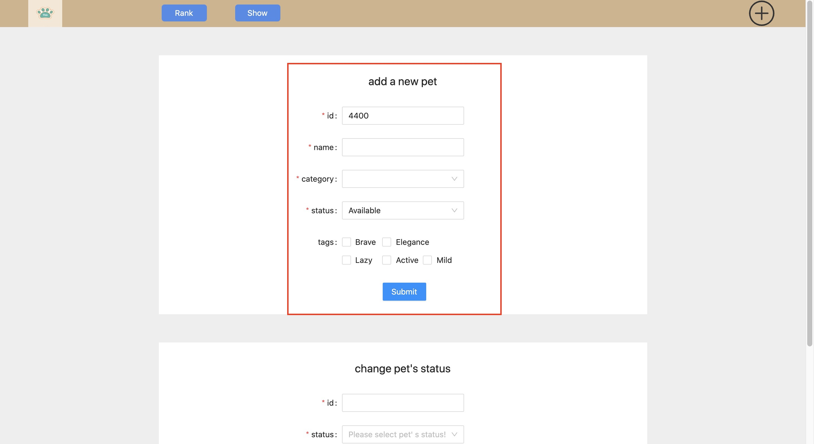
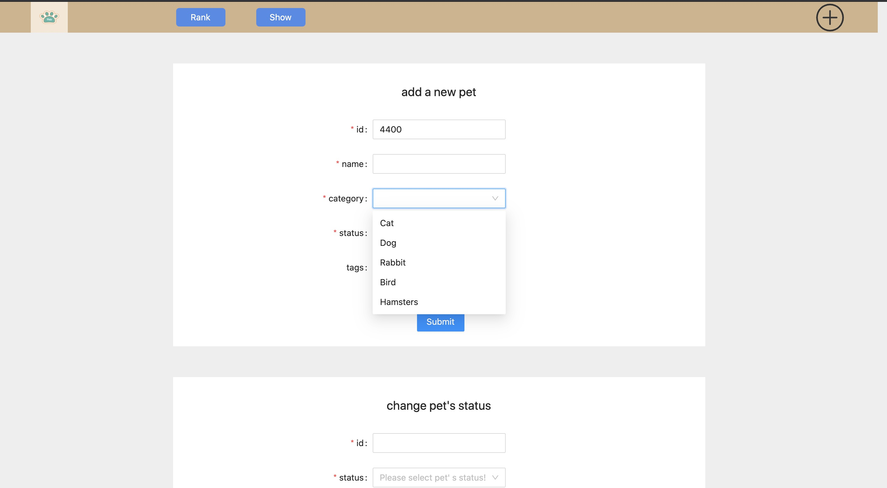
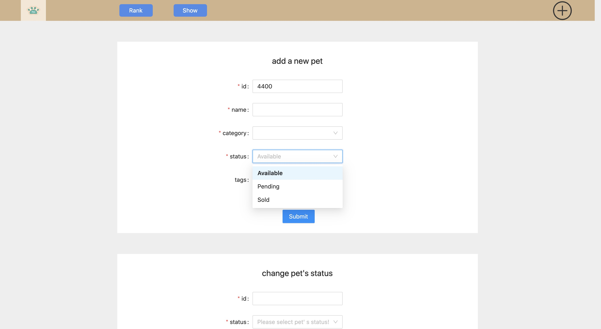
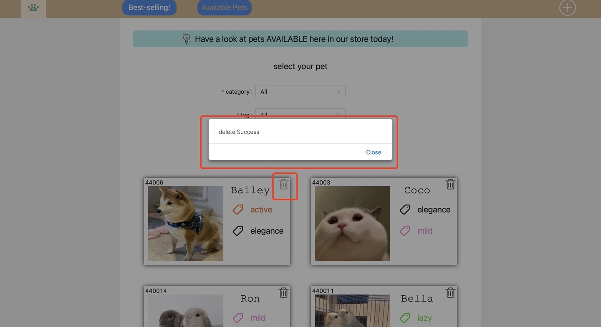
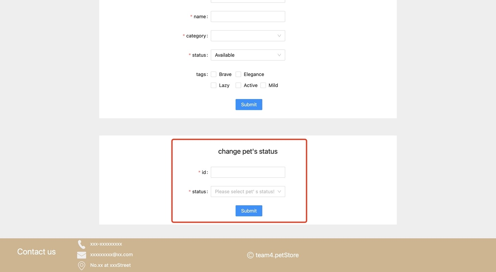
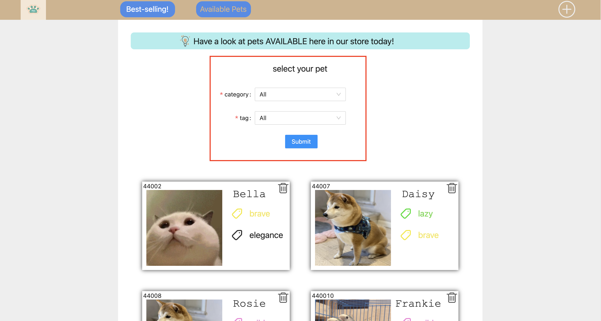
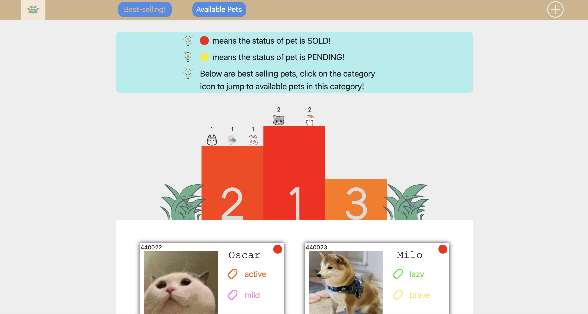

# Background

## Table of contents

- [Abstract](#jump1)

- [Objectives](#jump2)

- [Architecture and design](#jump3)

- [Full description of all features](#jump4)

### Abstract

With the current ongoing covid epidemic, people's lives have been affected to some
extent. Many people have had to switch to working from home and attending
classes. Longer home time and less social interaction has led many people,
especially those living alone, to consider acquiring a pet to keep them company
during this special time.

The epidemic has also made it less convenient and safe to go offline to buy a pet.
By going online, pet lovers can choose the pet of their choice without having
to take any risks. For pet shop owners, displaying their pets online is not
limited by the size of their premises, and subsequent management and sales
analysis is easier and more powerful.

The owner of one of our local pet shops was looking to set up his own pet website. This
project is the result of our team helping the local pet shop owner to set up a
website to showcase his pet shop online.

### Objectives

The pet shop website we built is based on the two main objectives of the pet shop owner to manage the pet data in the back office and to showcase the pets. Accordingly, the website will attempt to implement the following requirements.

- Add back-office pet data including name, species, sale status, personality tag

- Modify the current sale status of pets: available, pending, sold

- Display all the pets in the shop and support customers to search by type and personality tag

- Rank the most recent popular pets by sales

#### High-level goals

In addition to the above key objectives, the High-level goals of our project are

- Apply agile development principles to the development of the site

- Develop teamwork skills and improve the efficiency of our teamwork

- Develop team members' proficiency with Git

###  Architecture and design

At the beginning of the project, our group created a user survey to study the habits of potential customers and their user profiles concerning online pet shopping. Based on the feedback we received from 20 of our local friends, we identified the most requested features and discussed the initial framework of our website.

#### User research questionnaires

1. Male / Female

2. Age range 18-25 26-30 31-40 over 40

3. Previously have pets? Yes/No How many?

4. Plan to adopt a new pet? Yes/No

5. Have you surfed online pet store? Yes/No Which platform did you look at?

6. What features do you want to see on online pet stores?
   
   a. Search bar  

   b. Picture presenting
   
   c. Filtering of available items
   
   d. Bookmark favorite items
   
8. Others features you want to add? ___
   
9. Would buy pets based on what?

   a. Popularity according to past sales

   b. Pets characteristics

   c. Photos

   d. Others ____

##### Questionnaire feedback & analysis

Q1&2: 

Q3: 9/20 people have pets and only one pet for each person. 11/20 do not have pets.

Q4: 12/20 people have plan to adopt new pets.

Q5: 16/20 people have not surfed any online pet stores before as they prefer to go to offline stores more. 

 Consumers do not quite believe in the credibility of the online platforms and show very limited acceptance on this new type of pet shopping. Therefore our group plans to make the webpage pet info present & search only and leave trade & contact information in the footnote. In this way, customers can contact the shop owner directly after they see s something they are interested in and make a purchase thereafter.

Q6: 

| choice  | percentage chosed  |
|  -------- | ----------------------  |
| a.    Search bar  | 15/20 |
| b.    Picture presenting | 20/20 |
| c.    Filtering of available items  | 12/20 |
| d.    Bookmark favorite items  | 14/20 |

According to this data, our group plan to add all these features to our webpage.

Q7: Other features: Shopping basket, rank according to price. 

| choice  | percentage chosed  |
|  -------- | ----------------------  |
| a.    Popularity according to past sales  | 8/20 |
| b.    Pets characteristics  | 12/20 |
| c.    Photos  | 18/20 |
| d.    Others  | Health condition, breeding info, price, age…… |

#### Design of the website

The first interface "Available Pets！" shows the pets that are currently available. We can also make queries using the category and tag filter functions.

The second interface "Best-selling!", the pets' sales rank. By clicking on the category icon it jumps to available pets in this category.

The third interface is for the management of the pet website. Where we can set the id,
name, category, status and character tag for the new coming pet or change an existing pet's status.

###  Full description of all features

#### New added features

1. Adding new available pets with configurable information:
   
   - \***id**
   - \***name**
   - \***category** (e.g. dog/ cat/ fish)
   - \***status** (e.g. available/ sold. - Default: *available*)
   - **tag[]** (e.g. Brave/ Elegance/ Lazy/ Active/ Mild)

2. Deleting available pet.

   - By clicking deleting icon, with popped success alert.

3. Updating status of pet by entering ***id**.

4. Sorting pets by **category** and/or **tag** on available page.
  
    - One **category** and one **tag** could be chosen at the same time.

5. Showing sold pets with a ranking list, jumping to *available* page by clicking icon of **category** on the list.

   - The ranking list ranks top 5 best-selling **categories** with their sales.

   - When clicking on the icon of a **category**, it will jump to *available* page with request parameter of clicked icon's corresponding **category**, which will be automatically filled into the sorting form.

  #### Features not implemented

   - Copying **id** to clipboard by clicking pet's **id**.  

   - Adding new *available* pets with default **id**, ~~**name**~~(useless, banned), ~~**status**(*available*)~~(done).

   - Sorting pets on *available* page by multiple **tags**.

   - Updating **available categories[]** which is selected while adding pets.

   - Updating **available tags[]** which is selected while adding pets.

   - Administrator authorization. 

   - Booking/Order system. 

   - Updating status of pets on *available* page.(Could be implemented after implementing administrator authorization)

   - Updating pet detail by **name**.(Not possible due to API)