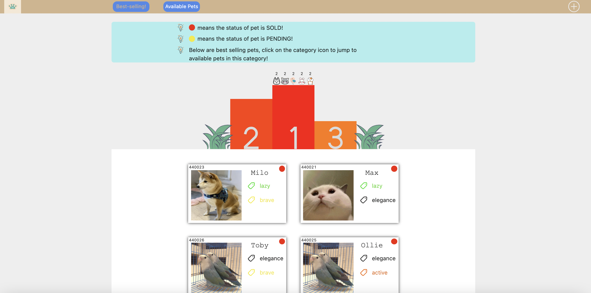
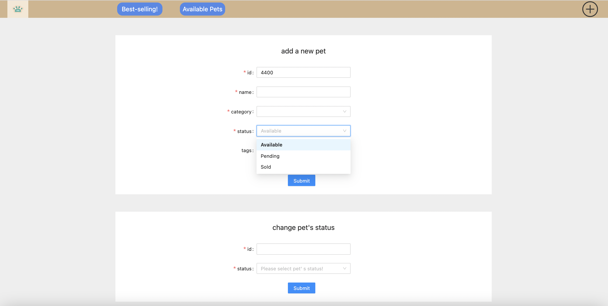
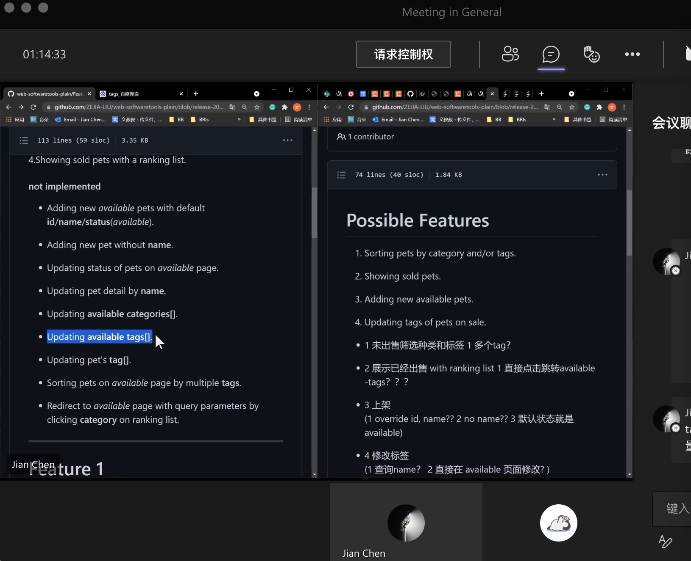

# Conclusion

  ## Table of contents

  - [Summary of project](#jump1)
  - [Analysis of project](#jump2)
  - [Reflect on group practice and teamwork](#jump3)

  ## Summary of project

  ### Prototype of the project

  This project is about the design of pet website functions. Our team members (a total of five) are arranged to design a series of functions for the online website of a pet shop owner, so as to make the online website more attractive to customers and improve the convenience for the owner and buyers to use the website.

  ### Discussion of new features for the project

  In order to improve the convenience and visibility of the website, after a group discussion, we decided to add the following functions. These functions take into account the convenience of the store manager for warehouse management, as well as customers screening pets and checking the needs of remaining pets.

  To meet these needs, we have made three pages. One is to show which pets are not yet sold. This interface also adds a filter function. From the customer's point of view, it is convenient for customers to complete pet queries based on certain conditions, such as pets. There are five species in our group, including cats, dogs, rabbits, hamsters, and birds. Our group also set up five types of pet personalities, namely, lively, brave, lazy, docile, and cold. This can largely satisfy customers' selection of pets, and at the same time improve retrieval efficiency and transaction rate. Obviously, an operating website that is not user-friendly to customers is difficult to leave customers to continue using and recommend to others.

  

  The second interface is to show the animals that have been sold. In this interface, the best-selling pets will be displayed and sorted according to the sales volume. By clicking the pet icon on the sorting chart, the page of this kind of pets can be directly jumped to. Our group design this function because of data collection, through we think that the customer's consumer psychology, almost determines their shopping this behavior, consumer psychology is the sum of consumer's consumer psychology and purchasing psychology, and psychological process of consumer purchase behavior is often 3 process, including the cognitive process of the commodities, mood and emotional process, will process. For a customer without a clear shopping goal, the herd effect will greatly dominate the customer's process of understanding and will, and then lead to a perceptual perception that pets that are sold more are more suitable for feeding, more suitable for personality and a series of judgments. Obviously, when customers want to buy a pet, but without a specific standard of pet, the benefits of this page is to lead customers to consume, and customers are willing to pay for the high sales of pet, so as to increase the income of the manager, in addition, the manager can timely by looking at the high sales of pet, in the warehouse to complement of the species, It's a win-win situation.

  

  The design concept of the third interface is to improve the convenience for the store manager to manage pet websites. You can enter the third interface by clicking the plus sign in the upper right corner of the pet website. From the manager perspective, the running of the pet website, you need to introduce a new pet, provide for the customer choice, customers to buy the pet at the same time, the manager should be the first to set the pet's condition, to prevent conflicts caused by the number of users to buy the same pet, the manager on this page you can change the state of pet has three, respectively is sold, Pending, available, so that customers can make a correct choice and purchase, and maintain the normal operation of the pet website.

  

  ### The final performance of the project

  During the meeting, our group conducted a complete demonstration of the entire pet website, and we were very satisfied with the entire functional module. At the same time, in order to make the page look more vivid, some styles have been added to make the whole project more complete and more attractive to customers to use and purchase pets. From the experience of the website, it is also more convenient for customers and store managers. It is expected that this project can bring a good user experience to customers and a higher profitability for the store manager.

  ## Analysis of project

  ### Whether the expected goal has been achieved

  The expected goal of our group is to improve the ease of use of pet websites, thereby increasing the transaction rate on pet websites. At present, the several website functions added after our group discussion have achieved the expected goal from the test, but considering each group meeting, the members will put forward their own ideas and opinions, and then we will discuss the feasibility together, so our Functional iterations have always existed. 

  ### Further optimize the direction analysis of the project

  At the meeting on August 4th, our group put forward some achievable functions. We decided to give a brief introduction to these feasible suggestions. Considering time constraints, this part of the function will not be carried out in our project.

  

  - For the pet website, it is more appropriate for the store manager to have a special permission function. Therefore, it is safer to set the administrator to log in to the system. It can prevent others from maliciously modifying the content of the pet website. You can make a permission login system. Make this pet website safer and more in line with the actual performance.

  - Considering that it is more convenient for the store manager to add new pets, you can automatically generate a default petId without entering petId when adding a new pet to the warehouse. The performance of petId is actually a series of complex numbers, which is not conducive to find and then enter it into the pet website.

  - On other pet websites, we can often see that the store manager will give each pet a name suitable for them, with different styles, taking into account the convenience of changing the pet’s detailed information. Set up a new function, through which the store manager can directly input the pet’s name to find the pet and modify the information without using petId. This is mainly for convenience.

  - Considering that the pet store may have new pet types for sale in the future, so you can set the available category. Through this function, the store manager can customize new pet types.

  - Considering that our project has set up a rank tag, this tag allows people to easily view the pet sales rankings, so in the future, we can add the function of available tags to add new tags to pets, such as pets that have been vaccinated, the pet category is this week’s sales champion and other tags and so on.

  - In order to be more targeted, multiple tags can be used to query pets to improve search efficiency. For example, according to customer needs, select their favorite pet character, and pets need to be vaccinated, etc., multiple tags can facilitate customers directly locate a pet that meets psychological expectations.

  These functions are really achievable functions under the existing database and API. The purpose is still to improve the convenience of people using the website. However, considering the time limit, our team is here to make a functional outlook and look forward to this project can get better in the future.

  ## Reflect on group practice and teamwork

  ### Reflection on group practice

  We will discuss the feasibility of the new ideas mentioned in the group meeting of the team. As long as it is feasible, we will try our best to achieve it. However, the process of this practice does encounter some obstacles. For example, there is a function that is very good, but because we multiple types of pet types are set, and there are many copies of imported pet data. 
  
  This leads to the fact that if you want to implement this function, then these data must be set with corresponding codes. One is more cumbersome, and second, bear in mind it's also a live API provided, anyone can post, so it's very twitchy. This may cause the data to disappear.

  ### Reflection on teamwork

  In addition, our team is very active to communicate about this project, and the number of group meetings is more frequent, so that everyone can clearly know the part of the task that they are responsible for, and have a function of the code part of the new project. A clear understanding will help us write and unify the report.