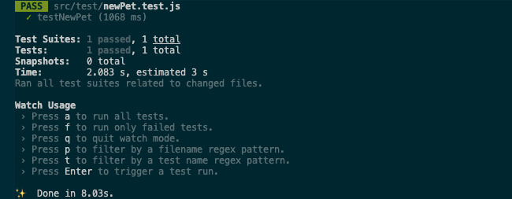
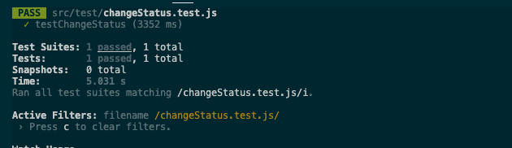
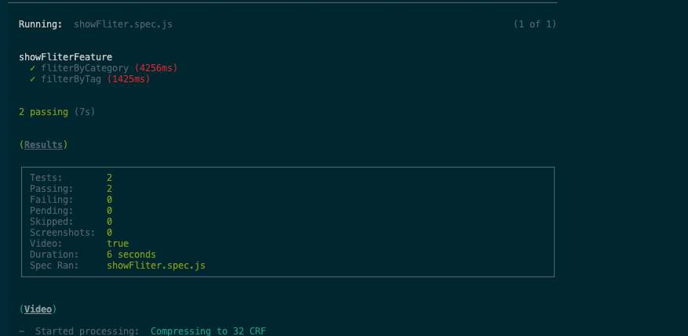
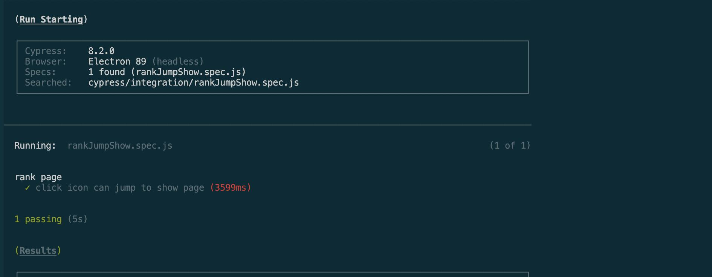

# Possible Features

1. Adding new available pets with more details / deleting available pet.
    > Default adding **status**: *available*.

2. Updating status of pet by **id**.  

3. Sorting pets by **category** and/or **tag**.

4. Showing sold pets with a ranking list, jump to *available* page with certain category parameter by clicking **category** icon on the list.

## ->>>>>> not implemented 

- Copying **id** to clipboard by clicking pet's **id**.  
- Adding new *available* pets with default **id**~~/**name**~~(useless, banned), ~~/**status**(*available*)~~(done).
- Sorting pets on *available* page by multiple **tags**.
- Updating **available categories[]** which is selected while adding pets.
- Updating **available tags[]** which is selected while adding pets.
- Administrator authorization. 
- Booking/Order system. 
- Updating status of pets on *available* page.
    > Could be implemented after implementing administrator authorization.
- Updating pet detail by **name**.
    > Not possible due to API.

---

# Feature 1
> Administrator authorization feature not implemented so everyone is permitted to do.

- ### Adding new available pets with configurable information:

  - ***id**
  - ***name**
  - ***category** (e.g. dog/ cat/ fish)
  - ***status** (e.g. available/ sold **default: *available***)
  - **tag[]** (e.g. Brave/ Elegance/ Lazy/ Active/ Mild)

- ### Deleting available pet
    > With poped alert to double check.

---

> - ***id** is required because it's reserved for querying, while the back-end does not support auto increment of pet's **id**.
> 
> - ***name**, ***category**, ***status**, are required because they are necessary for every pet.
> 
> - **tag[]** are optional, just for more detailed record.
>   > **tag[]** are only selectable(from **available tags[]**), they do not support customisation insertion due to the API data structure, updating **available tags[]** could only be done in editing source code.

## Justification

- When adding new available pets onto the website, besides pet ***name**, shopkeeper would like to upload more information about them, such as ***category**, ***status** and **tag[]**.

- This feature helps shopkeeper to manage pets in inventory with more details.

- This feature let visitors see more detailed information and distinguish different pets.

- Shopkeeper could delete pets on available page to manage inventory. 

# Testing

- We test this feature by automated unit testing tool: ***jest***.
  > Because this feature is mostly implemented by one specific function.

## Testing Details

  1. Mock data of a pet being added.
  2. Call the tested adding function with the data as parameter.
  3. Check whether response from the function(which is received from back-end) is consistent with the mocked data.  

### Testing Process

1. Install jest(Add package into package.json file)
2. Create testing file: 
```
web-softwaretools-plain/src/test/newPet.test.js
```
```javascript
import { addPet } from '../module/index'
const newPEt = {
    name: 'testPet',
    category: { name: 'test', id: 0 },
    status: 'sold',
    tags: [],
    id: 99999
}
test('testNewPet', () => {
    return addPet(newPEt).then(res => {
        const { data } = res
        expect(data.name).toBe('testPet')
        expect(data.category.name).toBe('test')
        expect(data.category.id).toBe(0)
        expect(data.status).toBe('sold')
        expect(data.id).toBe(99999)
    })
})
```
3. Change directory to:
```
web-softwaretools-plain
```
4. Run commands:
```
npm install
npm run test newPet.test.js
```  
    
### Testing Result

  
  
---

# Feature 2

- ### Updating status of pet by entering ***id**.

## Justification

- When a pet is sold, shopkeeper could update its status from *available* to *sold*, the pet would no longer be shown on the available page, which keeps the available page showing the most recent inventory.

- *sold* pets are still remaining in the website, helping shopkeeper to review business.

# Testing

- We test this feature by automated unit testing tool: ***jest***.
  > Because this feature is mostly implemented by one specific function.

## Testing Details

  1. Adding a new pet as test object, whose status is *sold*.
  2. Changing the pet's status to *pending*.
  3. Query the test pet and check whether its status is *pending*.
  
### Testing Process

1. Install jest(Add package into package.json file)
2. Create testing file: 
```
web-softwaretools-plain/src/test/changeStatus.test.js
```
```javascript
import { addPet, changeStats, findById } from '../module/index'
const newPEt = {
    name: 'testPet',
    category: { name: 'test', id: 0 },
    status: 'sold',
    tags: [],
    id: 99999
}
test('testChangeStatus', () => {
    return addPet(newPEt).then(res => {
        return changeStats(99999, 'pending').then(res => {
            return findById(99999).then(res => {
                const { data } = res
                expect(data.status).toBe('pending')
            })
        })
    })
})
```
3. Change directory to:
```
web-softwaretools-plain
```
4. Run commands:
```
npm install
npm run test changeStatus.test.js
```  
    
### Testing Result

  

---

# Feature 3

- ### Sorting pets by **category** and/or **tag** on available page.
  > One **category** and one **tag** could be chosen at the same time.

## Justification

- Most visitors have a clear purpose of which **category**/**tag** of pet they like, so they want to filter the inventory.

- It is more efficient for the shopkeeper to gain an overview and manage available pets by sorting.

- Visitors without a clear purpose could also get an overview of what **category**/**tag** of pets are on sale and browse pets with more comparability.

# Testing

- We test this feature by automated integration testing tool: ***cypress***. 
  > Because this feature deals with different pages so we chose integration testing but not unit testing.

## Testing Details

  - Sorting by **category**:
    1. Mock data of a random **category** being sorted.
    2. Visit the sorting page with the mocked **category** data as parameter.
    3. Check whether every displayed ***liWrap's*** class is consistent with the mocked **category**. 
        > Every *pet-card* has a unique **liWrap** DOM element.
   
  - Sorting by **tag**:
    1. Mock data of a random tag being sorted.
    2. Visit the sorting page with the mocked **tag** data as parameter.
    3. Check whether every displayed ***tagsWrapper's*** children tags contains one tag DOM element whose tagname is consistent with the mocked tag's name.
        > Every *pet-card* has a **tagsWrapper** DOM element which contains pet's all tags.

### Testing Process: 

1. Install cypress(Add package into package.json file)
2. Create testing file: 
```
web-softwaretools-plain/cypress/integration/showFliter.spec.js
```
```javascript  
describe('showFliterFeature', () => {
    it('fliterByCategory', () => {
        const categoryArray = ['cat', 'dog', 'bird', 'rabbit', 'hamsters']
        const random = Math.floor(Math.random() * 5);
        const category = categoryArray[random]
        cy.visit(`https://zejia-liu.github.io/web-softwaretools-plain/#/?category=${category}`)
        cy.get('.liWrap').should('have.class', category)
    })
    it('filterByTag', () => {
        const tagArray = ['brave', 'active', 'lazy', 'elegance', 'mild']
        const random = Math.floor(Math.random() * 5);
        const tag = tagArray[random]
        cy.visit(`https://zejia-liu.github.io/web-softwaretools-plain/#/?category=all&tag=${tag}`)
        cy.get('.tagsWrapper').each(div => {
            expect(div.children().find('.tagName').filter(`.${tag}`).length).not.to.eq(0)
        })
    })
})
```
3. Change directory to:
```
web-softwaretools-plain
```
4. Run commands: 
```
npm install
./node_modules/.bin/cypress run --spec ./cypress/integration/showFliter.spec.js
```
### Testing result:

  

---

# Feature 4

- ### Showing sold pets with a ranking list, jumping to *available* page by clicking icon of **category** on the list.

  > - The ranking list ranks top 5 best-selling **categories** with their sales.
  > 
  > - When clicking on the icon of a **category**, it will jump to *available* page with request parameter of clicked icon's corresponding **category**, which will be automatically filled into the sorting form.

## Justification

- Shopkeeper could analyse business and customers' preference by checking *sold* pets.

- knowing best-selling **categories** would help shopkeeper with arranging future management like updating inventory.

- Visitors without a clear purpose could take a look, and it would help them to discover their preference(**category**).

- some people tend to buy best-selling **categories** driven by group psychology, and inventory of those would be exactly the most after shopkeeper's business analysis.  

- Junmping to **available** page with request parameter gives all users much convenience in finding certain kind of *available* pets the want.

# Testing

- We test this feature by automated integration testing tool: ***cypress***. 
  > Because this feature deals with different pages so we chose integration testing but not unit testing.

## Testing Details

  - Clicking to jump to *available* page with url including right **category**:
    1. Visit the *sold* page.
    2. Mock data of a random **category** being clicked.
    3. Mock clicking the icon correspondence to the mocked **categoty**.
      > Use *data_cy* to set and *cy.get* locate exact **category** of icon.
    4. Check whether the requesting Url is expected. 
      > Url includes ***`/?category=${category}`***.

### Testing Process: 

1. Install cypress(Add package into package.json file)
2. Create testing file: 
```
web-softwaretools-plain/cypress/integration/rankJumpShow.spec.js
```
```javascript  
describe('rank page', () => {
    it('click icon can jump to show page', () => {
        cy.visit('https://zejia-liu.github.io/web-softwaretools-plain/#/sold')
        const categoryArray = ['cat', 'dog', 'bird', 'rabbit', 'hamsters']
        const random = Math.floor(Math.random() * 5);
        const category = categoryArray[random]
        cy.get(`[data-cy=${category}]`).click()
        cy.url().should('include', `/?category=${category}`)
    })
})
```
3. Change directory to:
```
web-softwaretools-plain
```
4. Run commands: 
```
npm install
./node_modules/.bin/cypress run --spec ./cypress/integration/rankJumpShow.spec.js
```
### Testing result:

  
