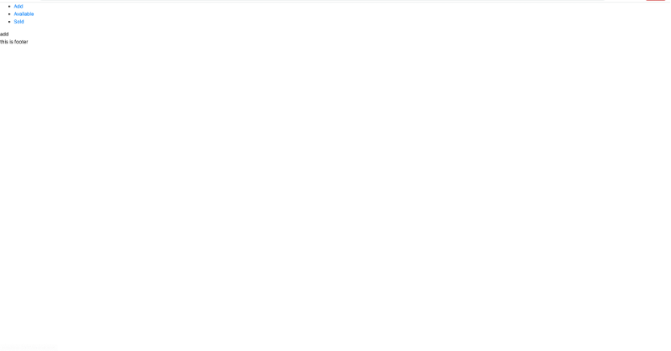
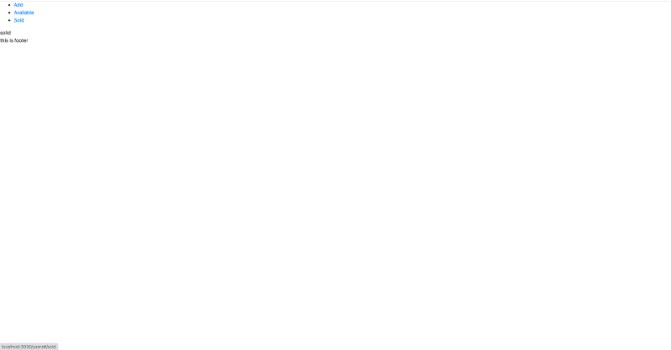
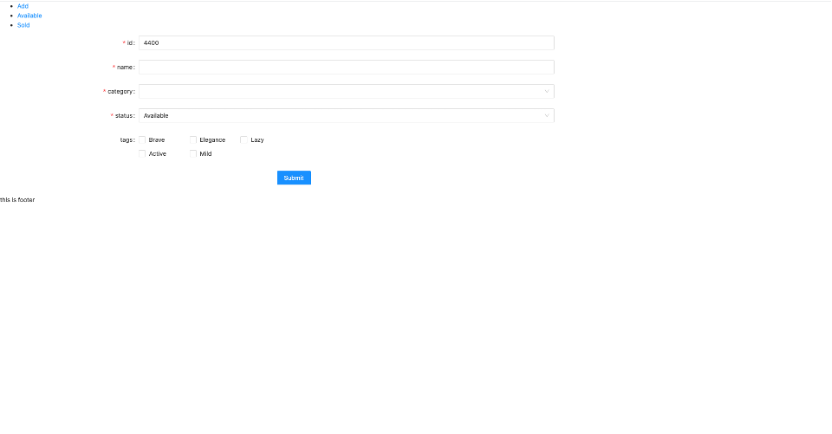
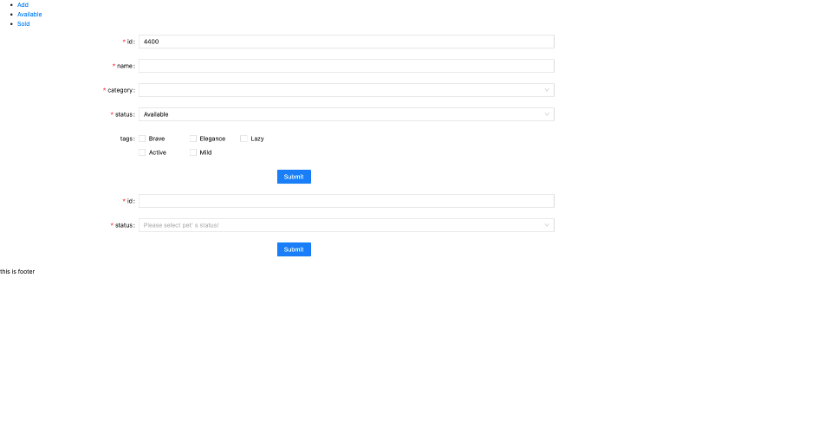
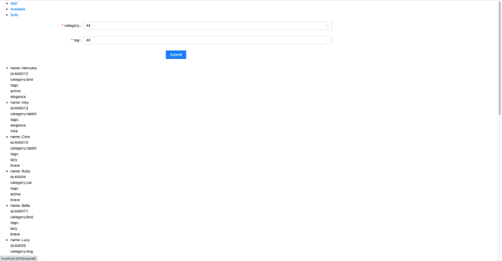
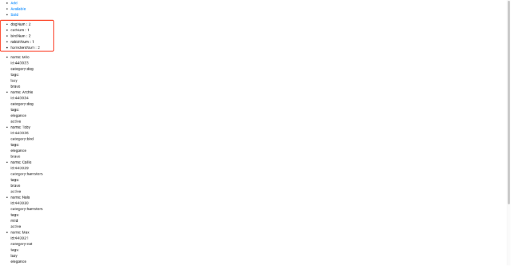
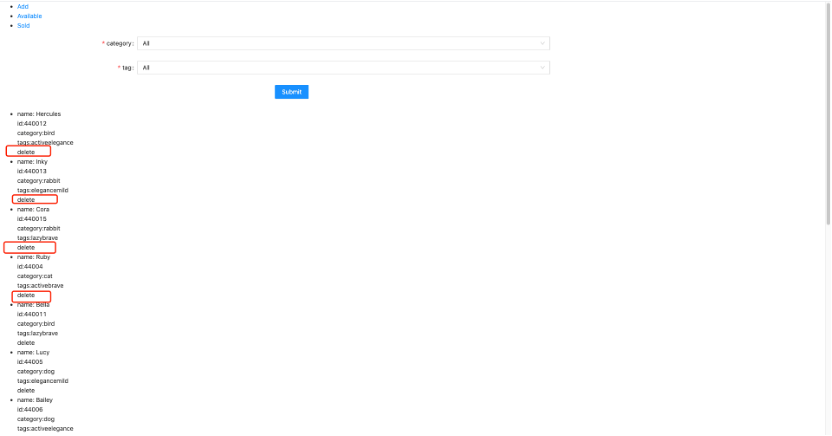
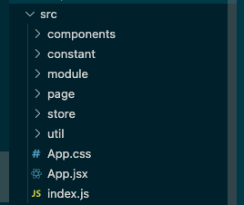

# UX Development
原来的代码使用原生js进行开发的。经过讨论决定（后面会有具体的原因），我们打算使用react框架进行开发。因此我们决定从0开始搭建网站
搭建网站我分为两大部分，第一部分是完成功能，第二部分是写style(css)
## 实现功能
### 1. 引入react进行开发，实现hello world页面：
* 详细内容:
用create-react-app 这个命令，实现react的初始化。然后删除不需要的文件，只保留最简单的文件结构
* 图片:


* commit: e5745f1764d9af54a4214dbd8bb13c88de9a467d
* time: 2021/07/27 21:16

### 2. 完成module目录 
* 详细内容: 这一部分是没有ui上面的变化的，只是根据我们网站的feature，对有可能用到的api进行封装，然后放到module目录中。由于这个项目比较简单，所以我们统一把所有需要用的的api写在module/index.js文件中。
在这一部分我们引入了axios库，对api进行封装，返回一个Promise instance，以便于调用的时候进行错误处理。
根据功能，选择了4个api，分别是
1. findByStatus (/pet/{petId}/uploadImage)
2. delete （/pet/{petId}）
3. add (/pet)
4. update  (/pet/{petId})

其中findByStatus, delete, add 是在原来的网站中就有使用的，而update是我们新调用的api

* 图片: 没有ui上的变化
* commit: 6d51adb8a6e45afa34f27eb8e1dad0556127db62
* time:  2021/07/28 : 10:42

### 3. 确定网站结构
* 详细内容: 根据需求，我确定了网站的结构
1.	一共需要三个页面，分别是available，sold，add（页面的名字有可能后续会发生变化）
2.	每个页面都有header main footer。因此我们把header和footer抽离出来，作为三个页面的公用组件，每个页面的main不相同。

    引入react-router 实现不同页面之间的跳转
* 图片：
1. page available 

2. page add

3. page sold


* commit: e6bce91551030471ba85272deec55c7a7602a364
* time: 2021/07/28 12:00

### 4. add页面添加可以添加宠物的表单
* 详细内容: 使用antd的form表单组件，根据项目具体需要的功能进行修改，通过提交form表单即可以创建新的pet。需要搜集的信息有id，name，category，status，tags。其中要注意的是，我们的id以4400开头，是为了不修改到其他人的数据，怕overwrite其他组的成员创建好的宠物。
* 图片: 

* commit: 0b082b9bd299f102b805fc821a24768ef733c382
* time: 2021/07/28 17:54

### 5. add页面添加可以修改宠物状态的表单
* 详细内容: 引入antd的form组件，只需要输入需要修改状态的宠物的id，还有新的状态，就可以实现宠物的状态修改
* 图片:

* commit: c9e393f085f4741b355488194673823830baa82f
* time: 2021/07/29 20:18

### 6. available页面的筛选表单
* 详细内容: available页面本来只是展示可以购买的宠物。我们根据新的feature，加入了form表单，让用户可以更具自己的喜好进行筛选，可以选择宠物的category和tag

* 图片:

* commit: c9e393f085f4741b355488194673823830baa82f
* time: 2021/07/29 20:18

### 7. sold页面加入统计模块
* 详细内容:sold页面原本只是对状态为sold和pending的宠物进行展示。根据新feature的需要，我们加入一个统计的模块，根据宠物的category，对数量进行统计
* 图片:

* commit: c9e393f085f4741b355488194673823830baa82f
* time: 2021/07/29 20:18

### 8. sold页面的统计模块升级为rank模块
* 详细内容: 我们原本只是希望sold页面可以展示已经出售的宠物各个种类的数量，但是由于新的需求，我们需要根据各个种类出售的数量，做一个rank表。具体的实现方法是，我们得对原本的数组进行一次sort，让该数组从大到小排序
* 图片: 

* commit: c9e393f085f4741b355488194673823830baa82f
* time: 2021/07/29 20:18

### 9. 实现sold页面和available页面之间的跳转
* 详细内容: 新的功能需要点击sold页面中rank模块对应的宠物，就可以跳转到available页面中category对应的宠物的筛选结果。具体的实现是通过跳转时带上query实现的。跳转用的是react-router的```history.push```这个函数
* 图片: 没有ui上的改动
* commit: 5b18ebc1924dd005fb39af6cd0d851e8038fa4d8
* time: 2021/08/02 23:40

### 10. 实现available页面中宠物的删除
* 详细内容: 加入了删除宠物的功能。只要点击宠物的delete按钮，就会触法帮点在onClick的event的函数，把当前的宠物的id最为参数，调用该函数，最终调用delete的api，在数据库中删除宠物，同时更新页面
* 图片:

* commit: c9e393f085f4741b355488194673823830baa82f
* time: 2021/07/29 20:18
# Final UX
写完css在具体写着一块
1. 公共组件:
    1. header
    * 布局
    * 功能
    2. footer
    * 布局
    * 功能

2. ava页面
* 布局
* 筛选表单
* 展示list
3. sold页面
* 布局
* rank
* 展示list
4. add页面
* 布局
* 添加表单
* 修改状态表单
# Design Choices
## 1、 框架选择
### 1、 sample vs 框架
1. 不选择框架
        
    对于操作较为复杂的页面，sample js代码中会混入出现非常多的html，而且api的名称都很长，代码过长不易维护，开发效率低。对于本项目是需要快速开发的，时间非常的重要，所以应该选择框架进行开发。
2. 选择框架
    框架的本质是对sample js的api进行一层封装，让程序员能够更加方便的编写代码。其中优点有这么几点：
    * 组件化 让复杂的dom tree细分为一个个组件，更好的进行管理
    * api相对简单，设计模式一般为mvc，mvp，mvmm，代码可读性增强
    * 有大量现成的第三方组件，节省开发成本
### 2、 why react
1. react、vue and angular

    react、vue and angular是当前前端最流行的三大框架。本项目其实在结构与功能上讲，是一个非常简单的前端项目，因此三大框架都能满足功能上的要求。本次设计的主题是快速开发，而且时间紧迫，因此要考虑的关键因素是开发者对各个框架的熟悉程度，减少学习，熟悉新框架的时间成本。由于我对react的熟悉度最高，因此选择react进行开发。
2. react.js的优点
    * ReactJS应用程序由多个组件组成，每个组件都有自己的逻辑和控件。这些组件可以重用，这有助于你在处理大型项目时维护代码。
    * 性能方面，react使用虚拟dom(virtual dom),而且有自带的dom diff算法。这种要对dom节点进行频繁操作的网页（本项目中，要对pet list进行频繁的删减改操作），性能将会得到很大的优化。
    * 编写简单，ReactJS使用JSX文件，这使得应用程序更简单，更易于编码和理解
    * 存在大量现成第三方组件。像antd组件库中，有大量的react组件
    
## 2、 目录设计
一个好的目录，能够让整个项目的逻辑更加的清晰。可以从目录的名称，找到相对应的代码，进行一个集中化的管理。
本项目中，所有的代码都放在src目录下，src目录如图所示：



* components目录

    此目录是存放组件的，存放的组件有Footer、Header、Main、AddForm...当需要加入新的组件时，在该目录像创建新的文件即可。
* page目录

    这个目录是存放该网站的pages的，本网站的页面有Sold,available,add这三个
* constant目录

    这个目录下面存放的是一些常量，比如发送http请求的baseUrl，网站的兜底数据petData，宠物的种类，宠物的tags，宠物的status
* util目录

    这个目录是存放一些公共的方法函数的，避免同一个方法进行重复的创建。
* module目录

    这个目录适用于存放后端API的。根据我们的feature的需求，我们筛选所需要的后端api，使用axios这个库，对api进行封装，每个新的函数返回一个new Promise()，方便进行错误处理

* store
    
    这个目录用于存储全局的state，方便进行state control。使用了mobx作为状态管理的工具，把每个store创建新的文件，放于该目录下，以便使用。这个项目一共有两个store，分别是petArray（属于我们小组的pets的array）和addPet(要添加的新的宠物的属性)

## 3、数据设计
正常来说，这一部分是不属于前端的工作，但是由于本项目非常的特殊，使用的后端api和数据库是开放式的（所有人都能进行数据的操作），这导致数据库里面的数据，不一定是我们需要的，而且我们创建的数据也有可能被别的同学误删，或者我们不小心改变了别的同学的数据，因此我们需要想一些办法来解决这个问题。
1. 分辨哪些宠物是我们小组的。我们发现宠物的tags是一个数组，因此，我们在数组中push一个```{id:0,name:"team4"}```的对象。我们在获取到宠物的数据的array的时候，做一个filter，只有pet.tags这个数组中带有这个对象，才是我们小组的数据

2. 我们的数据被别人删除。我们需要设置一个兜底的本地数据，当拉去数据后，发现我们小组的宠物少于一定的数量，我们会批发的增加一些宠物

3. 避免修改别的小组的宠物。我们在新建宠物的时候，宠物的ID以4400开头，避免和别的小组造成id上面的重复

宠物的tags我们一共设置了5个，分别是：'brave', 'elegance', 'lazy', 'active', 'mild'

宠物的category我们也设置了5个，分别是：'cat', 'dog', 'bird', 'rabbit', 'hamsters'

## 4、 路由工具选择
经过讨论决定，我们的页面一共有三个，因此需要一个路由来实现页面之间的跳转。

由于使用的是react框架，我们决定react-router这个库来实现。

react-router里面一共有两种router，分别是BrowserRouter和HashRouter。从用法上，这两种用法是没有区别的。原理上hashrouter相当于一个锚点定位，因此不论#后面的路径怎么变化，请求的都相当于是#之前的那个页面。而BrowserRouter相当于一个新的路径。本项目为明显的前后端分离项目，为了部署的时候的方便，我们使用Hashrouter

## 5、 组件库选择
代码开发有一个原则，就是不要重复造轮子。对于有现成的组件，我们要做的是去使用它，而不是重新自己去写。由于本项目较为简单，组件也不是很多。我们使用的是react进行开发，目前较大的组件库有：antd、Bootstrap、Bulma、Chakra UI、Material UI...

经过对本项目需要的组件的评估，我们发现我们需要的只是form表单(其他组件的自定义度太高了，不方便使用别人的组件)。经过浏览各大组件库发现，antd的form表单不管从功能上还是style上，都能满足本项目的需求，而且他的引用也很方便，所以我们使用了antd作为我们的组件库。
## 6、 状态管理工具选择
状态管理库，其本质都是为了解决状态管理混乱，无法有效同步的问题

react框架目前两大状态管理工具是redux和mobx，他们有各自的特点：

1. redux
    * 单一store。store是应用管理数据的地方，在Redux应用中，我们总是将所有共享的应用数据集中在一个大的store中
    * Redux需要手动追踪所有状态对象的变更
    * 约定条件规范，适用于大型项目的团队开发
2. mobx
    * 多store。Mobx通常按模块将应用状态划分，在多个独立的store中管理。
    * Mobx中可以监听可观察对象，当其变更时将自动触发监听
    * 学习成本低，适用于小型项目的开发

根据这些特点，在分析我们项目。我们的项目无疑是一个小型项目，而且开发的人员很少，所以选择mobx这种轻量级的状态管理工具再适合不过了。

## 7、css vs scss
CSS是任何浏览器都可以用来设置网页样式的样式语言。

SCSS是的一种特殊类型的文件SASS，它是用Ruby编写的程序，CSS用于为浏览器组装样式表，并且为了提供信息，SASS还为CSS变量，嵌套等添加了许多其他功能，这些功能可以使编写CSS更加容易和快捷。

SCSS文件由运行Web应用程序的服务器处理，以输出CSS浏览器可以理解的传统格式。

在复杂的项目里面，使用scss无疑可以使开方便的更加方便，提高开发的速率。但是在像本项目一样的简单项目中，使用css就完全可以满足需求了。所以我们最后决定用css进行开发。
## 8、 样式布局选择
css的布局，目前流行的有三大布局，分别是float、flex和grid
1. 兼容性：grid布局的兼容性最差，flex和float的兼容性很好。
2. 使用难度：grid布局的api过长，不方便使用。float比较难布局无法完成响应式，而且需要消除浮动。flex布局灵活方便。
3. 实现上：由于我们的网页结构简单，是很经典的类型，三种布局方式都能够使用

总结：使用三中布局方案相互结合，根据组件的样式需求，各取所需：比如header里面会使用到float和flex，main主要使用的是flex，antd组件默认使用的是grid
# Evaluation 
