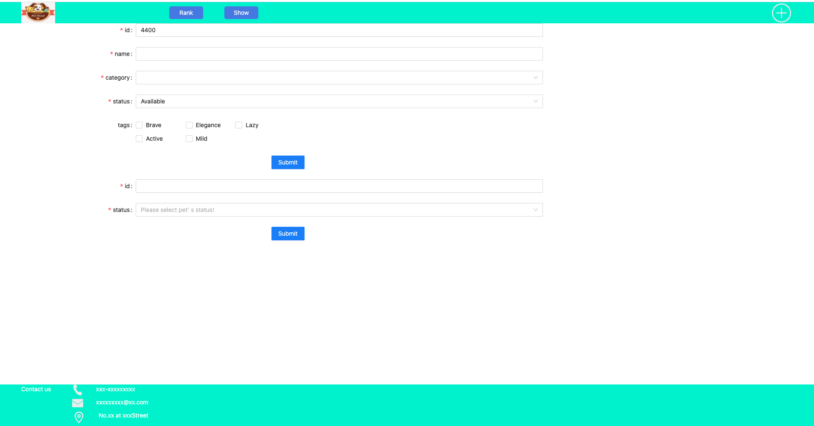
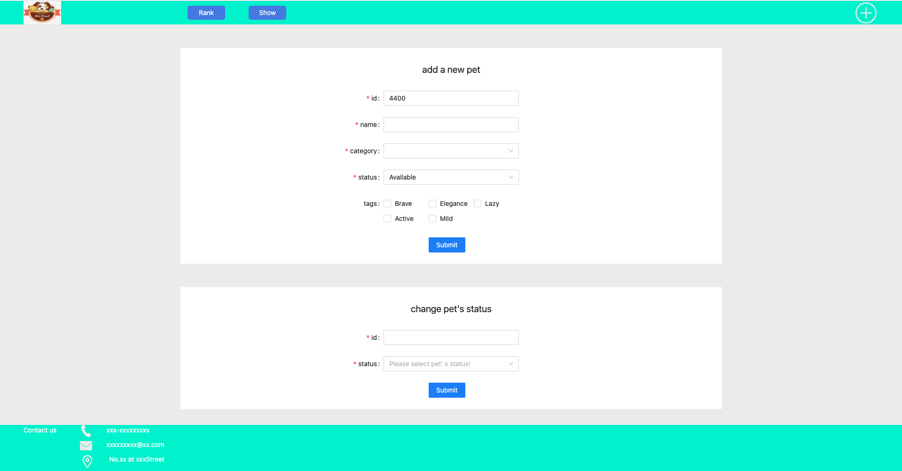
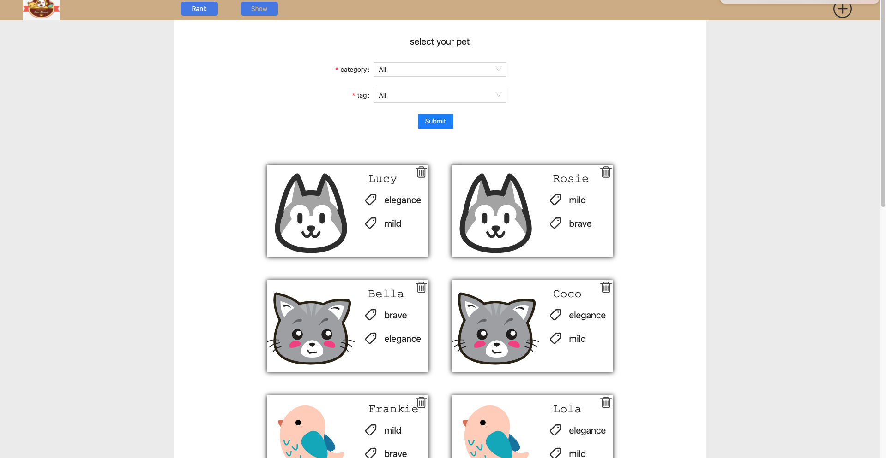
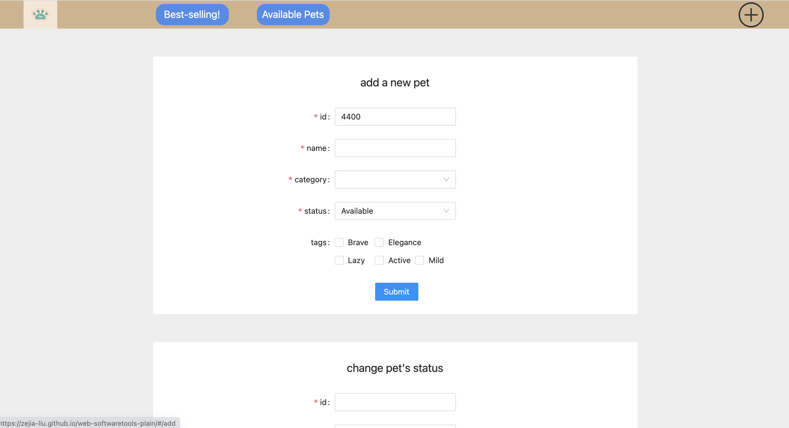
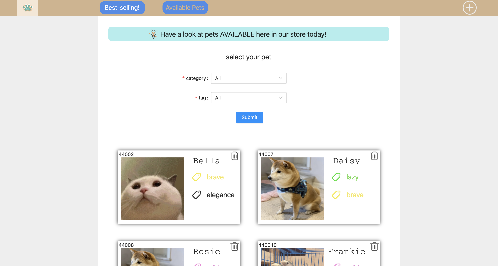

# UX Development
Since that the original codes are developed with js, we decided to switch to React framework to help with develop (detailed reasons listed in section below). Therefore, our team decided to build the webpage from beginning. 
Webpage building is made up of two main parts: 1. Realize new features 2. Style/UI (CSS)
## Realize features & functions
### 1. Introduce in React to help develop, realize 'Hello World' page：
* Detail contents:

    Use command 'create-react-app' to initialize React. Then delete unnecessary files and retain simplist file structure. 
* Picture:

* commit: e5745f1764d9af54a4214dbd8bb13c88de9a467d
* time: 2021/07/27 21:16

### 2. Accomplish module catalog 
* Detail contents:

    This part does not touch UI changes. We just follow our designs of new features to encapsulate useful APIs and then put in module catelogue. Since that this project is relatively easy, we just put all useful APIs in module/index.js. 
In this part we introduced axios to encapsulate API and then return a Promise instance in order to make it more convenient to handle mistakes when calling the API.

    According to our designed features we chose four APIs to use:
    1. findByStatus (/pet/{petId}/uploadImage)
    2. delete （/pet/{petId}）
    3. add (/pet)
    4. update  (/pet/{petId})

    Among them findByStatus, delete, add exist in original webpage while update is our new API to call. 

    * Picture: No changes to UI
    * commit: 6d51adb8a6e45afa34f27eb8e1dad0556127db62
    * time:  2021/07/28 : 10:42

### 3. Settle on webpage structure
* Detail contents:

    We settled down the webpage structure according to user demand
Three webpages are in need in total, including "available"，"sold"，"add". 
Each webpage has header, main, footer. 
Therefore we draw out header and footer to act as public components. Each page's main is different. 
We introduced in react-router to realize jump between different webpages. 

* Pictures：
1. page available 

2. page add

3. page sold


* commit: e6bce91551030471ba85272deec55c7a7602a364
* time: 2021/07/28 12:00

### 4. "add" page add form of available pets 
* Detail contents:

    Use antd's Form component and then modify according to new features' specific demand. 
Then we can create new pet via submitting Form. 
All info needed: id, name, category, status, tags.
PS: Our group's id starts with prefix 4400 in order to make sure that we would not modify other's data in the database. By using this prefix, we would not overwrite the pets created by other groups. 

* Pictures: 

* commit: 0b082b9bd299f102b805fc821a24768ef733c382
* time: 2021/07/28 17:54

### 5. "add" webpage add form of status of pets whose status could be modified
* Detail contents:
    
    Introduce in antd's Form component: We only need to input id of the pet that needs to update status and the new status then we can realize the modification of pet status. 

* Pictures:

* commit: c9e393f085f4741b355488194673823830baa82f
* time: 2021/07/29 20:18

### 6. "available" webpage's filtering form 
* Detail contents:

The "available" webpage was designed merely to present pets for purchase. However, we added form according to newly designed feature in order to let consumers to filter pets according their preference. They can choose to filter by choosing pet's category and tag.

* Pictures:

* commit: c9e393f085f4741b355488194673823830baa82f
* time: 2021/07/29 20:18

### 7. "sold" webpage add counting module
* Detail contents:

    The "sold" webpage was designed merely to present sold and pending pets. Following our newly designed feature, we added one counting module in this pageto count the number of pets of each category.

* Picture:

* commit: c9e393f085f4741b355488194673823830baa82f
* time: 2021/07/29 20:18

### 8. "sold" webpage's counting module upgrade to rank module 
* Detail contents: 

    We originally hoped that the quantity of sold pets of each category could be displayed on the "sold" page. However, due to the new demand, we need to make a rank table according to the sold quantity of each category. The specific implementation method is that we have to sort the original array once to sort the array from large to small. 
* Picture: 

* commit: c9e393f085f4741b355488194673823830baa82f
* time: 2021/07/29 20:18

### 9. Realize jump between "sold" and "available" webpage
* Detail contents: 

    For the new function, you need to click the pet corresponding to the rank module on the sold page to jump to the filtering results of the pet corresponding to the category in the available page. The specific implementation is realized by taking query when jumping.
    Jumping uses react-router's ```history.push```function. 

* Picture: No changes/updates to UI
* commit: 5b18ebc1924dd005fb39af6cd0d851e8038fa4d8
* time: 2021/08/02 23:40

### 10. Realize delete of pets in "available" webpage
* Detail contents: 

    Added the function of deleting pets. As long as you click the delete button of the pet, you will touch the event function of onclick. Take the ID of the current pet as the parameter, call the function, and finally call the delete API to delete the pet in the database and update the page at the same time. 


* Picture:

* commit: 5b18ebc1924dd005fb39af6cd0d851e8038fa4d8
* time: 2021/08/02 23:40

## Style/UI (CSS)
### 1. 完成header和footer的css
* 详细内容:

    header和footer的布局采用的方式是flex布局加上```position```定位。是传统的header和footer该有的样式。我把原来的available和sold的导航按钮修改为show和rank，更能突出他们在功能上的特点。add页面放到最右边，并且用了一个加号的icon代替了文字，在页面的最右边放上了一张图片作为logo。footer这一个模块并没有功能，只是一些信息的展示。
* Picture:


* commit: 025d5b3d456784cb2883f2db7435df5ec1b80048
* time: 2021/08/04 2021/08/04 02:10

## 2. 完成add页面的css
* 详细内容:

    由于这个页面使用的是antd的组件，已经自己带有样式了，我所有需要做的只是修改他们的布局，是整个页面看上去比较协调。

* picture:

* commit: f977f3f4de95bbc302468675c772f37c34e560b4
* time: 2021/08/04 02:44

## 3. 完成show页面的css
* 详细内容:

    1. 根据产品需求，修改了header和footer的background-color
    2. 过滤的form使用了antd的组件，只需要调整布局
    3. pet列表需要根据每个pet的data，制定card
* Picture:

* commit: 423b9e11e028444d7f496cb331f261f361915405
* time: 2021/08/04 21:55

## 4. 完成rank页面的css
* 详细内容:

    1. 制作排行榜
    2. 展示sold和pending的pet
* Picture:


* commit: da6a6a225c8e3e283603141e821d28aef7972915
* time: 2021/08/05 03:08

## 5. 修改footer样式
* 详细内容:

    1. icon 垂直对齐
    2. 加入copyRight
* Picture:


* commit: 4123e5388f2d97a3424d7a0d932f86b2d842f8ca

* time: 2021/08/05 03:43
# Final UX
## 1. header
1. 图片:

2. 布局:

    使用的是flex布局，主要的element有三个，分别是logo，包涵了rank和show按钮的wrapper的element和add的icon。
    最左边的logo为装饰作用，主要页面为rank和sold，因此把它们放在较为中间的部分，最后add页面放在最右边，而且用icon代替文字

3. 交互(事件):
    
    * rank，show，add在hover的时候，都会用样式的变化
    * 根据当前页面的不同，对应页面的导航元素(rank,show,add)也会有样式的变化
    * rank，show，add点击后能跳转到对应页面
4. 功能:
    
    是一个nav，起到页面跳转的功能

## 2. footer
1. 图片:

2. 布局:

    footer的布局很简单，从左到右分为三块，分别是contact文字，联系方式和copyright。背景色采用和header一样的深颜色，文字和icon使用浅颜色，提高辨别度。
4. 功能:

    商家联系方式的展示还有版权声明

## 3. add页面
1. 图片:


2. 布局:

    add页面一共有两个大元素，分别是两个form表单，分别是添加新宠物的表单，我们叫它addForm，还有修改宠物状态的表单，我们叫它changeForm。两个表单我们垂直排列，呈上下结构。背景色使用白色，表单直接使用margin隔开，使他们不会混在一起，层次感更加明显。
3. 交互(事件):

    两个表单使用的都是antd组件库的组件，所以已经自己带有了事件。我们需要在summit上面绑定事件，根据用户填写的内容，整理称为参数，调用后端api，发送http请求即可。
    addFrom表单连接的后端API是addPet；changeForm连接的后端api是update

4. 功能：

    添加新的宠物和修改宠物状态

## 4. show页面
1. 图片:

2. 布局:

    整个Show页面只有两个大元素，分别是筛选的form表单，我们叫它fliterForm还有宠物列表，我们叫它petList。两个大部分还是采用了垂直布局，上面放着fliterForm，洗面放petList。

    petList里面是由petCard组成的，petList采用flex布局，让petCard呈每行2个原素分布，让页面结构更加优美。
    petCard包括了petImg，tags，id，name和deletIcon。petImg是根据宠物的category不同，展示不同的icon，它是用于区别不同宠物的，因此我们把它做的很大并且放在card的左边（就像id card一样）。name放在右边的上方，并且修改了它的字体还有大小，使得它能够一眼就被发现。tags放在name下面，并且在文字的左边放上一个tag的icon来表示它是一个标签。至于宠物的id，我们把它放到了左上角，然后删除的icon放到了右上角。


# Design Choices
## 1. Framework choice 
### 1. sample vs framework
1. Do not choose framework

    For pages with complex operations, a lot of HTML will be mixed into the sample JS code, and the API names are very long, the code is too long, difficult to maintain, and the development efficiency is low. For this project, it needs rapid development, and time is very important, so the framework should be selected for development.
2. Choose to use framework

    The essence of the framework is to encapsulate the API of sample JS, so that programmers can write code more conveniently. 
    Advantages of using framework：
    * Componentization allows complex DOM trees to be subdivided into components for better management
    * The API is relatively simple, the design patterns are generally MVC, MVP and mvmm. The code readability is enhanced
    * There are a large number of ready-made third-party components to save development costs. 
    
### 2. Why react
1. React, Vue and Angular

    React、Vue and Angular are the three most popular front end framework nowadays.
This project is a relatively easy front end project if seeing it from the view of features and structure. Therefore the three frameworks above can all fulfill basic requirements of this project.
However, since that this project requires quick & agile development as the time is limited we chose to use React as our main developers are most familiar with React. 

2. React.js's advantages 

    * ReactJS is made up of lots of components and each compnent has its own logic and controls. These components could be reused which helps a lot with code maintenance when handling large project.  
    * Speaking of function and performance，React uses virtual dom and it has its own dom diff algorithm. This helps optimize performance when the web needs frequent handling of dom nodes. For instance, in this project, we need to carry out frequent add, delete, modify to pet list. 
    * Easy to code: ReactJS uses JSX file which makes coding and understanding much easier. 
    * Has a lot of third party components to use. Like antd component warehouse, it has large amounts of React components. 
    
## 2. Catalog design 
A good catalog would make the logic of the whole project much clearer. From the names in the catalog we can find corresponding codes and carry out a centralized management.  
In this project all the codes are put under src catalog: 


* components catalog
This catalog is designed to store components such as Footer、Header、Main、AddForm...
When we need to add new components. we can create new files under this catalog. 

* page catalog
This catalog is designed to stores pages of this website, including "sold", "available" & "add".
  
* constant catalog
Some constants are stored under this catalog like baseUrl used to send http requests. petData, pet categories, pet tags, pet status. 

* util catalog
This catalog is designed to store some public functions in order to avoid repeat creation of same function. 
    
* module catalog
This catalog stores backend APIs. Following our designed features we filtered out needed APIs and then use axios to encapsulate APIs. 

* store catalog
This catalog is designed to store global state in order to carry out state control conveniently. 
We used mobx as status management tool. Newly created files for each store are stored under this catalog to be used. 
This project has two stores, one is petArray (array of pets belonging to out team) and another is addPet (properties of newly added pets)
    

## 3. Data design
Normally speaking this part does not belong to front end. However this project is very special as backend APIs and database are both public for which everyone can modify data. 
This results in the situation that not all data in the database are needed by us and our newly created data has the possibility to be deleted by other people. Additionally, chances are that we might change other people's data by mistake as well. Therefore we came up with same methods to solve this issue. 
1. Make clear which pets belong to our group. We find that pet tages are arrays. Therefore we push an object of ```{id:0,name:"team4"}```。
    When we get array of pets data, we can do filtering where only pet.tags has this object and that's our group's data. 

2. 
    Since that our data might be deleted by others we need to set a backup data locally. If we find that the pets number is smaller than a specific number when getting data we would add some pets automatically.

3. To avoid changing other group's pets we set our group's pets ids with prefix of 4400 which differentiates our IDs with other teams.

We set five tages for our pets: 'brave', 'elegance', 'lazy', 'active', 'mild'

We set five categories for our pets：'cat', 'dog', 'bird', 'rabbit', 'hamsters'

## 4. Routing tools choice
Following our design we have three webpages in total so we need a router to help us handle jump between webpages. 
Since that we use React framework, we decide to use react-router. 

React-router has two kinds of router which are BrowserRouter和HashRouter.
These two has no difference from function perspective.
Theoretically, HashRouter is like an anchor location. No matter how paths after # change, requests all focus on the webpage before #. On the other side, BrowerRouter is like adding a new path. 
For this project we use HashRouter as this project's front end and backend is dividied up a lot. 


## 5. Component library choice
Following the development rule that if existing components could be used then we need to use them instead of coding by ourselves again. For this project, not too many components are in need to use and nowadays large component libraries include antd、Bootstrap、Bulma、Chakra UI、Material UI...

Following our analysis of the project, we find that all we need is form.  Therefore after reviewing all these component libraries, we find that antd's form can fulfill this project's requirement and the introduction of this library is also very easy. Therefore we use antd as our component libraries.


## 6. State Management Tool choice 
State management library is used to handle state chaos, lack of effectlve synchronism issues.  

React framework currently has two main state management library which are redux and mobx:

1. redux
    * Single store. Store is where app manages data. In Redux, we tend to gather all shared app data in a big store.  
    * Redux needs trace the changes of all state objects by hand. 
    * More suitable for large project development. 
2. mobx
    * Multiple stores。Mobx divide app state by module and store in multiple independent stores. 
    * Mobx can monitor on observables，when objects change automatic monitoring would turn on. 
    * Low learning cost and suitable for small project development.

Since that our project is no doubt a relatively small project and our developer are not too many so we choose to use light tool of Mobx. 


## 7. css vs scss
CSS is the website style language applicable for any browser. 

SCSS is a special type of file SASS. It's program coded using Ruby. CSS is used to assemble style sheets for browsers. Additionally, in order to provide info, SASS also adds many other functions to CSS variables and nesting etc. These functions could make it easier and quicker to code CSS.  

The SCSS file is processed by the server running the web application to output a traditional format that the CSS browser can understand.

In complex projects, the use of SCSS can undoubtedly make the development more convenient and improve the speed of development. However, in a simple project like this project, CSS can fully meet the requirements. So we finally decided to develop with CSS.

## 8、 CSS layout choice
At present, there are three popular CSS layouts: float, flex and grid. 
1. Compatibility: Grid layout has the worst compatibility while flex and float have good compatibility.
2. Use difficulty: The API of grid layout is too long and inconvenient to use. Float is difficult to layout, cannot complete the response, and needs to eliminate float. Flex layout is flexible and convenient.
3. Realization: Because our web page has a simple structure and is a classic type, all three layout methods can be used.

Conclusion：Combine the three layout schemes with each other and each takes its own needs according to the style requirements of components. For example, float and flex are used in header, flex is mainly used in main, and grid is used by default in antd component. 

# Evaluation 
### HCI Questionnaire
1.    Are our new features practical and easy to understand?   Yes/No
2.    How do you feel about our webpage UI design?
       a.    very good   b. good  c. fair d. not good enough  
3.    Are our new added features good & convenient to use?  Yes/No
4.    Is the interaction enjoyable?  Yes/No
5.    Which places do you think we can still do better on?
       __________________
