# UX Development
Since that the original codes are developed with js, we decided to switch to React framework to help with develop (detailed reasons listed in section below). Therefore, our team decided to build the webpage from beginning. 
Webpage building is made up of three main parts: 
1. Realize new features 
2. Style/UI (CSS)
3. Modify according to users' feedback

## Realize features & functions
### 1. Introduce in React to help develop, realize 'Hello World' page：
* Detail contents:

    Use command 'create-react-app' to initialize React. Then delete unnecessary files and retain simplist file structure. 
* Picture:

* commit: e5745f1764d9af54a4214dbd8bb13c88de9a467d
* time: 2021/07/27 21:16

### 2. Accomplish module catalog 
* Detail contents:

    This part does not touch UI changes. We just follow our designs of new features to encapsulate useful APIs and then put in module catelogue. Since that this project is relatively easy, we just put all useful APIs in module/index.js. 
In this part we introduced axios to encapsulate API and then return a Promise instance in order to make it more convenient to handle mistakes when calling the API.

    According to our designed features we chose four APIs to use:
    1. findByStatus (/pet/{petId}/uploadImage)
    2. delete （/pet/{petId}）
    3. add (/pet)
    4. update  (/pet/{petId})

    Among them findByStatus, delete, add exist in original webpage while update is our new API to call. 

    * Picture: No changes to UI
    * commit: 6d51adb8a6e45afa34f27eb8e1dad0556127db62
    * time:  2021/07/28 : 10:42

### 3. Settle on webpage structure
* Detail contents:

    We settled down the webpage structure according to user demand
Three webpages are in need in total, including "available"，"sold"，"add". 
Each webpage has header, main, footer. 
Therefore we draw out header and footer to act as public components. Each page's main is different. 
We introduced in react-router to realize jump between different webpages. 

* Pictures：
1. page available 

2. page add

3. page sold


* commit: e6bce91551030471ba85272deec55c7a7602a364
* time: 2021/07/28 12:00

### 4. "add" page add form of available pets 
* Detail contents:

    Use antd's Form component and then modify according to new features' specific demand. 
Then we can create new pet via submitting Form. 
All info needed: id, name, category, status, tags.
PS: Our group's id starts with prefix 4400 in order to make sure that we would not modify other's data in the database. By using this prefix, we would not overwrite the pets created by other groups. 

* Pictures: 

* commit: 0b082b9bd299f102b805fc821a24768ef733c382
* time: 2021/07/28 17:54

### 5. "add" webpage add form of status of pets whose status could be modified
* Detail contents:
    
    Introduce in antd's Form component: We only need to input id of the pet that needs to update status and the new status then we can realize the modification of pet status. 

* Pictures:

* commit: c9e393f085f4741b355488194673823830baa82f
* time: 2021/07/29 20:18

### 6. "available" webpage's filtering form 
* Detail contents:

The "available" webpage was designed merely to present pets for purchase. However, we added form according to newly designed feature in order to let consumers to filter pets according their preference. They can choose to filter by choosing pet's category and tag.

* Pictures:

* commit: c9e393f085f4741b355488194673823830baa82f
* time: 2021/07/29 20:18

### 7. "sold" webpage add counting module
* Detail contents:

    The "sold" webpage was designed merely to present sold and pending pets. Following our newly designed feature, we added one counting module in this pageto count the number of pets of each category.

* Picture:

* commit: c9e393f085f4741b355488194673823830baa82f
* time: 2021/07/29 20:18

### 8. "sold" webpage's counting module upgrade to rank module 
* Detail contents: 

    We originally hoped that the quantity of sold pets of each category could be displayed on the "sold" page. However, due to the new demand, we need to make a rank table according to the sold quantity of each category. The specific implementation method is that we have to sort the original array once to sort the array from large to small. 
* Picture: 

* commit: c9e393f085f4741b355488194673823830baa82f
* time: 2021/07/29 20:18

### 9. Realize jump between "sold" and "available" webpage
* Detail contents: 

    For the new function, you need to click the pet corresponding to the rank module on the sold page to jump to the filtering results of the pet corresponding to the category in the available page. The specific implementation is realized by taking query when jumping.
    Jumping uses react-router's ```history.push```function. 

* Picture: No changes/updates to UI
* commit: 5b18ebc1924dd005fb39af6cd0d851e8038fa4d8
* time: 2021/08/02 23:40

### 10. Realize delete of pets in "available" webpage
* Detail contents: 

    Added the function of deleting pets. As long as you click the delete button of the pet, you will touch the event function of onclick. Take the ID of the current pet as the parameter, call the function, and finally call the delete API to delete the pet in the database and update the page at the same time. 


* Picture:

* commit: 5b18ebc1924dd005fb39af6cd0d851e8038fa4d8
* time: 2021/08/02 23:40

## Style/UI (CSS)
### 1. header & footer's CSS
* Detailed contents:

 The layout of header and footer is flex layout plus ```position```positioning. It is the style of traditional header and footer. I changed the navigation buttons of the original "available" and "solid" to "show" and "rank", which can better highlight their functional characteristics. The add page is placed on the far right, and a plus sign icon is used to replace the text. A picture is placed on the far right of the page as the logo. The footer module has no function, just the display of some information.

* Picture:
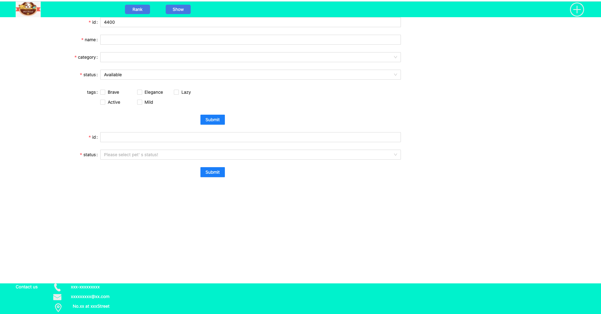

* commit: 025d5b3d456784cb2883f2db7435df5ec1b80048
* time: 2021/08/04 2021/08/04 02:10

### 2. "add" webpage's CSS
* Detailed contents:
 Since that this page uses antd components, it has its own style. All I need to do is modify their layout, so the whole page looks more balanced.

* Picture:
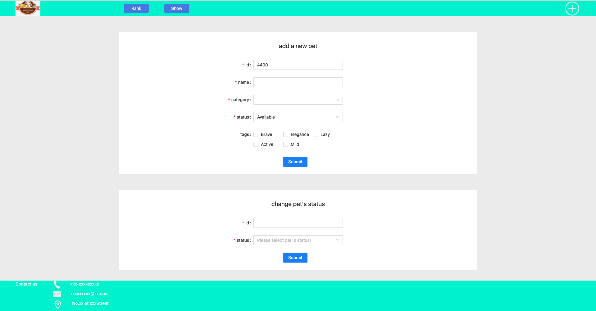
* commit: f977f3f4de95bbc302468675c772f37c34e560b4
* time: 2021/08/04 02:44

### 3. "show" webpage's CSS
* Detailed contents:
  1. Modify the background color of header and footer according to product requirements
  2. The filtered form uses the components of antd, and only needs to adjust the layout
  3. The pet list needs to formulate a card according to the data of each pet

* Picture:
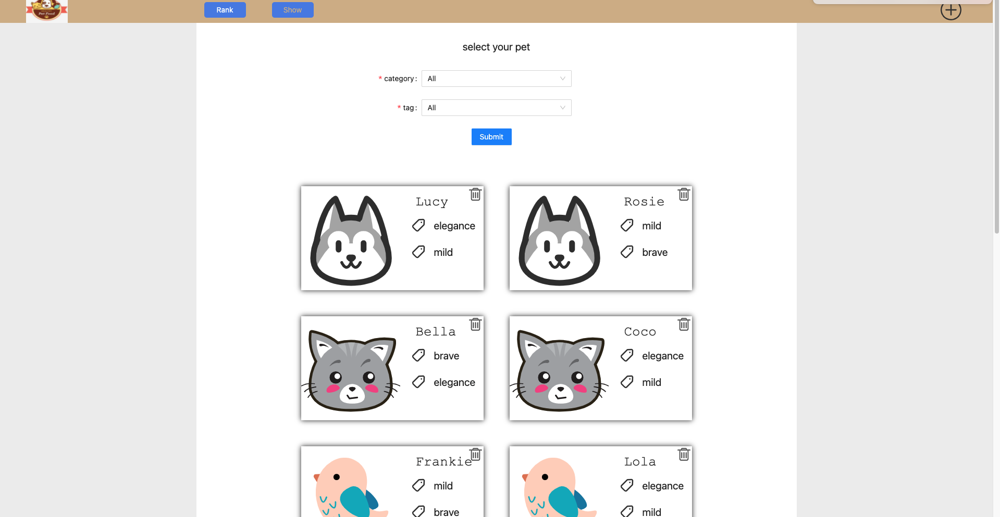
* commit: 423b9e11e028444d7f496cb331f261f361915405
* time: 2021/08/04 21:55

### 4. "rank" webpage's CSS
* Detailed contents:
  1. Make ranking list
  2. Display the pets of sold and pending
* Picture:
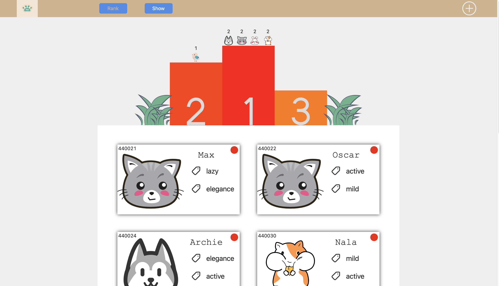

* commit: da6a6a225c8e3e283603141e821d28aef7972915
* time: 2021/08/05 03:08

### 5. Modify footer's design
* Detailed contents:
    1. icon vertical alignment
    2. add copyRight
* Picture:


* commit: 4123e5388f2d97a3424d7a0d932f86b2d842f8ca

* time: 2021/08/05 03:43

## Modify according to users' feedback

### 1. Use real pet pics to replace icon & make the page more colorful 
* Detailed contents:

    1. uses hope that the webpage should contain more real pet picture. So we replaced original petCard img to real pictures of pets. 
    2. We use different icon color and font color according to different icon contents because users want to webpage to look more colorful. 
* Picture:
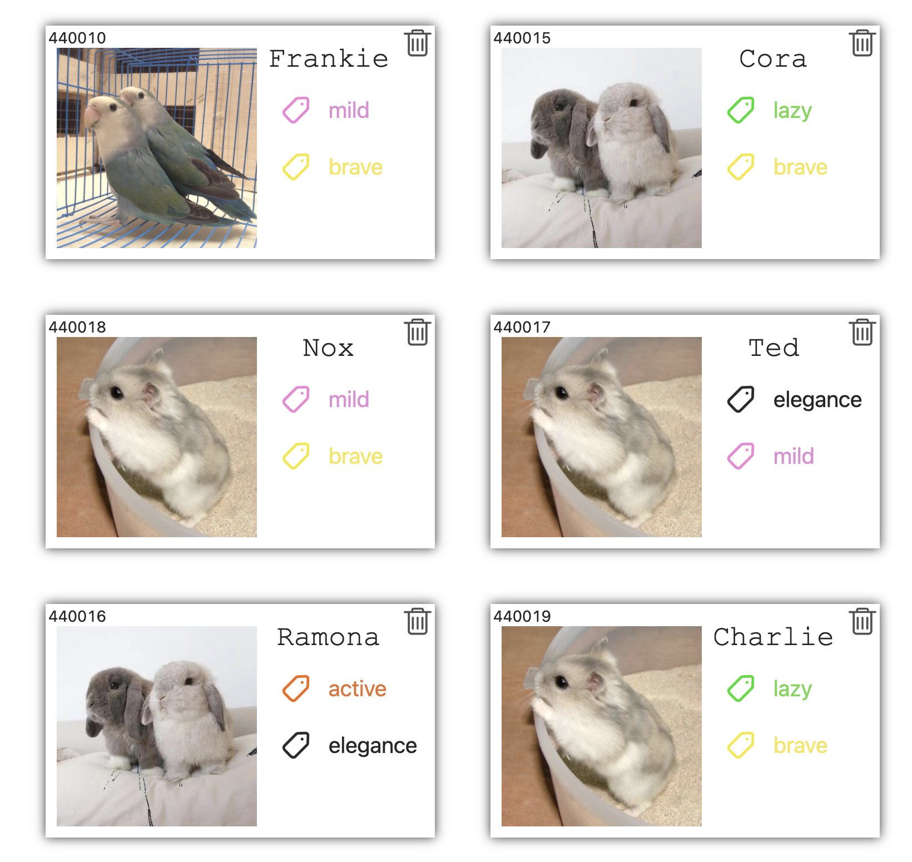

* commit: ea33a83ea50b94e071635de41ef58197c431384a
* time: 2021/08/06 19:47

### 2. Modify nav's content & add tips 
* Detailed contents:

    1. Since that users think the status of pets are not easy to identify we changed the contents in nav and improved readability. After modification, animal status is easier to identify.
    2. Added tips on "rank" and "show" webpage in order to make features more understandable. 

* Picture:

    1.rank webpage

    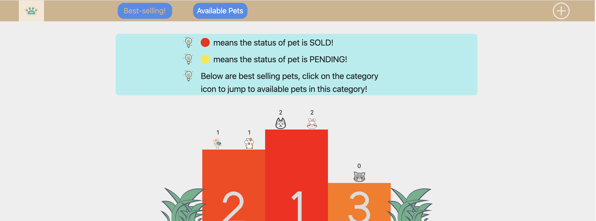
    2. show webpage

    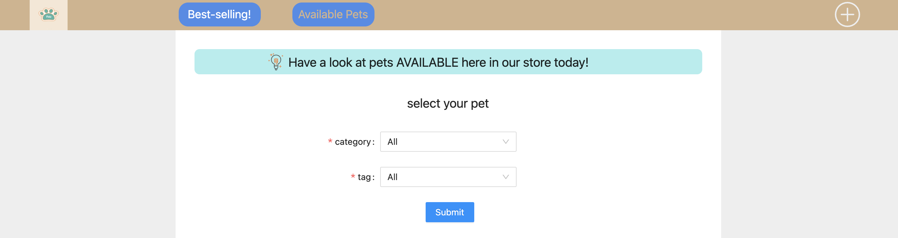
* commit: 26462ae6b9bc26d90ae86ceae4ec6b8560583542
* time: 2021/08/08 17:07

# Final UX
## 1. header
1. Picture:

2. Layout:

    The header has four elements: logo, best selling button, available pets button and an add Icon. The logo is the display function, and the other three elements are the webpage jumping function. Since the header is used for navigation, we expand the elements horizontally. The order from left to right is logo, best selling, available pets and add Icon. Since best selling and available pets are the main pages, they are placed in the middle and occupy a larger volume.

3. HCI event:
    
    * When hovering aboce best-selling, available-pets and add icon, user can see change of icon pattern.
    * Aest-selling button, Available-pets button, Add icons would appear differently on different webpages to help people know which webpage they are viewing. 
    * When clicking on these three icons, people can go to corresponding webpages.  
    
4. Functions:
    <nav> helps with the webpage jumping function.

## 2. footer
1. Picture:

2. Layout:
    The layout of footer is very simply, from the left to right are contact test, contact details and copyright. The background color is set to be same as that of header's to improve consistency. The icon color and text color are set to be light to help improve readability. 
3. Function:
    Presesnt contact details of the shop owner and clarify copyright of photos used. 
    
## 3. "add" webpage
1. Picture:
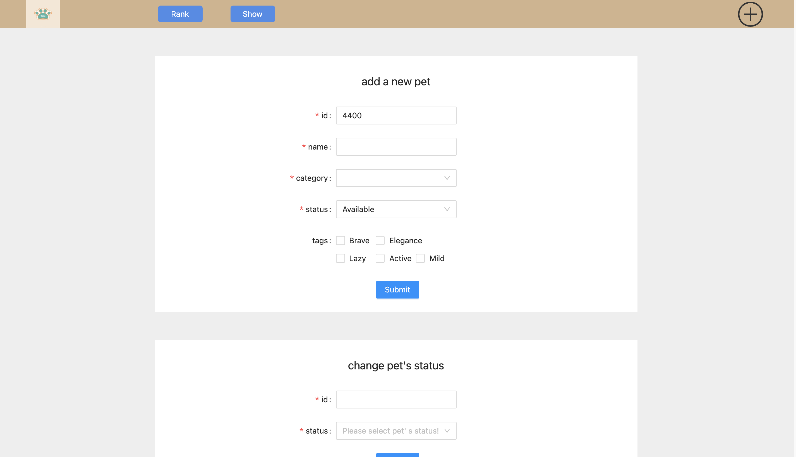

2. Layout:
   The add webpage has two main elements: two forms, the form for adding new pets, which we call addForm, and the form for modifying pet status, which we call changeForm. The two forms are arranged vertically in a top-down structure. The background color is white, and the forms are directly separated by margin, so that they will not be mixed together. In this way, the sense of hierarchy is more obvious.
   
3. HCI (event):
   Both forms use components of the antd component library, so they have their own events. We need to bind events on summit, sort out the parameters according to the contents filled in by the user, call the back-end API and send HTTP requests.
   The back-end API of addFrom form connection is addpet; The backend API of the changeForm connection is update. 

4. Function：
Add new pets and modify pet status.

## 4. "available-pets" webpage
1. Picture:
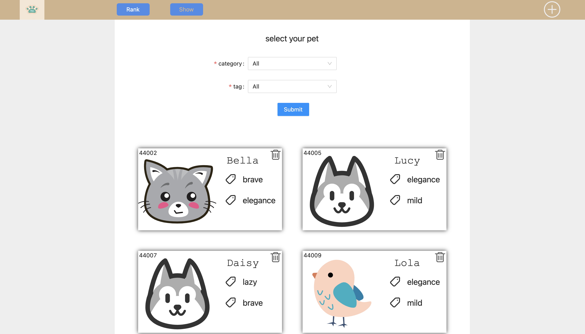
2. Layout:
    
    The whole available pet page has only three elements, namely tips, filtered form, which we call fliterForm, and pet list, which we call petList. The whole page is arranged vertically, with tip, fliterForm and petList from top to bottom.

    The petList is composed of petcard. The petlList adopts flex layout, so that the petCard is distributed with 2 elements per line, making the page structure more beautiful.
    
    PetCard includes petimg, tags, ID, name and delet icon. PetImg displays different icons according to different pet categories. It is used to distinguish different pets, so we make it large and put it on the left of the card (just like ID card). Name is placed at the top of the right, and its font and size are modified so that it can be found at a glance. Tags is placed under name, and a tag icon is placed on the left of the text to indicate that it is a tag. As for the Pet ID, we put it in the upper left corner, and then the deleted icon in the upper right corner.
3. Interaction event

The function of fliter form is to select the type and tag according to the user's preferences, and filter the displayed pets by clicking submit.
Pet list acts as display function. After deleting icon and hover above the upper right corner of petCard, the transparency will change, and the mouse style will also change, prompting the user to click here. Click Delete Icon to delete the petCard.


4. Function
    1. Display available pets.
    2. Filter pet list according to users' preference.
    3. Delete pets. 

## 5. "best-selling" webpage
1. Picture:
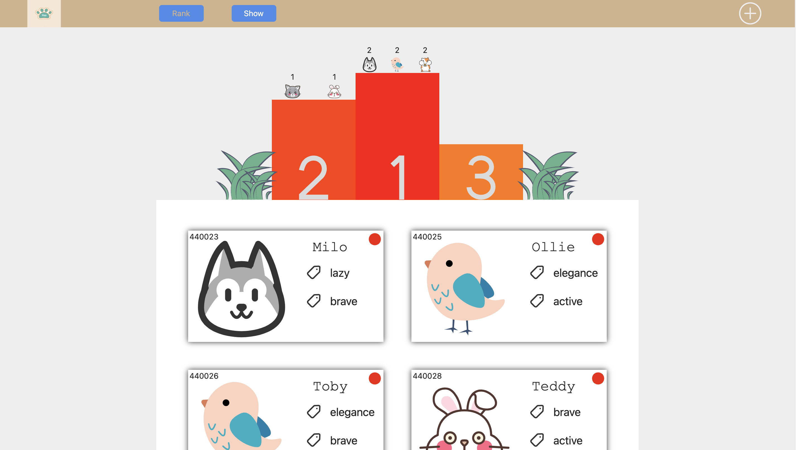
2. Layout:

The best showing page is composed of three elements. It adopts a vertical layout, with tip, leaderboard and petlist from top to bottom.

Among them, the design of tip and petlist is basically the same as that of the available pet page. The only difference is that the upper right corner of petcard is changed from the original deleteicon to the circle icon indicating the status, the red icon indicates that the pet's status is solid, and the yellow flag indicates that the status is pending.
   
The ranking list is designed in the form of a podium. From left to right, we design the second, first and third places at a time (in fact, if there are fourth and fifth places, we also put them in the third column). Standing on the podium is the icon of the corresponding pet type and the number of pets they have sold (pets in the status of sold and pending are considered to have been sold). On the left and right sides of the podium are two grass icons for decoration.

3. Interaction event
Through the mouse hover, the transparency of the pet icon on the podium and the style of the mouse will change, prompting the user that these icons can be clicked. By clicking these icons, you can jump to the available pet page, and the jump URL takes the parameter category = ${pet}, so that the pet list of the "available" page only displays the pets of this category.
Pet list is also a display function. The color of the icon in the upper right corner of each petcard represents the status. 

4. Function
    1. Display pets under the status of sold and pending.
    2. Pets that have been sold or are being sold are ranked according to their category and displayed on the ranking list.
    3. Click the pet icon on the ranking feature to jump.
    
# Design Choices
## 1. Framework choice 
### 1. sample vs framework
1. Do not choose framework

    For pages with complex operations, a lot of HTML will be mixed into the sample JS code, and the API names are very long, the code is too long, difficult to maintain, and the development efficiency is low. For this project, it needs rapid development, and time is very important, so the framework should be selected for development.
2. Choose to use framework

    The essence of the framework is to encapsulate the API of sample JS, so that programmers can write code more conveniently. 
    Advantages of using framework：
    * Componentization allows complex DOM trees to be subdivided into components for better management
    * The API is relatively simple, the design patterns are generally MVC, MVP and mvmm. The code readability is enhanced
    * There are a large number of ready-made third-party components to save development costs. 
    
### 2. Why react
1. React, Vue and Angular

    React、Vue and Angular are the three most popular front end framework nowadays.
This project is a relatively easy front end project if seeing it from the view of features and structure. Therefore the three frameworks above can all fulfill basic requirements of this project.
However, since that this project requires quick & agile development as the time is limited we chose to use React as our main developers are most familiar with React. 

2. React.js's advantages 

    * ReactJS is made up of lots of components and each compnent has its own logic and controls. These components could be reused which helps a lot with code maintenance when handling large project.  
    * Speaking of function and performance，React uses virtual dom and it has its own dom diff algorithm. This helps optimize performance when the web needs frequent handling of dom nodes. For instance, in this project, we need to carry out frequent add, delete, modify to pet list. 
    * Easy to code: ReactJS uses JSX file which makes coding and understanding much easier. 
    * Has a lot of third party components to use. Like antd component warehouse, it has large amounts of React components. 
    
## 2. Catalog design 
A good catalog would make the logic of the whole project much clearer. From the names in the catalog we can find corresponding codes and carry out a centralized management.  
In this project all the codes are put under src catalog: 


* components catalog
This catalog is designed to store components such as Footer、Header、Main、AddForm...
When we need to add new components. we can create new files under this catalog. 

* page catalog
This catalog is designed to stores pages of this website, including "sold", "available" & "add".
  
* constant catalog
Some constants are stored under this catalog like baseUrl used to send http requests. petData, pet categories, pet tags, pet status. 

* util catalog
This catalog is designed to store some public functions in order to avoid repeat creation of same function. 
    
* module catalog
This catalog stores backend APIs. Following our designed features we filtered out needed APIs and then use axios to encapsulate APIs. 

* store catalog
This catalog is designed to store global state in order to carry out state control conveniently. 
We used mobx as status management tool. Newly created files for each store are stored under this catalog to be used. 
This project has two stores, one is petArray (array of pets belonging to out team) and another is addPet (properties of newly added pets)
    

## 3. Data design
Normally speaking this part does not belong to front end. However this project is very special as backend APIs and database are both public for which everyone can modify data. 
This results in the situation that not all data in the database are needed by us and our newly created data has the possibility to be deleted by other people. Additionally, chances are that we might change other people's data by mistake as well. Therefore we came up with same methods to solve this issue. 
1. Make clear which pets belong to our group. We find that pet tages are arrays. Therefore we push an object of ```{id:0,name:"team4"}```。
    When we get array of pets data, we can do filtering where only pet.tags has this object and that's our group's data. 

2. 
    Since that our data might be deleted by others we need to set a backup data locally. If we find that the pets number is smaller than a specific number when getting data we would add some pets automatically.

3. To avoid changing other group's pets we set our group's pets ids with prefix of 4400 which differentiates our IDs with other teams.

We set five tages for our pets: 'brave', 'elegance', 'lazy', 'active', 'mild'

We set five categories for our pets：'cat', 'dog', 'bird', 'rabbit', 'hamsters'

## 4. Routing tools choice
Following our design we have three webpages in total so we need a router to help us handle jump between webpages. 
Since that we use React framework, we decide to use react-router. 

React-router has two kinds of router which are BrowserRouter和HashRouter.
These two has no difference from function perspective.
Theoretically, HashRouter is like an anchor location. No matter how paths after # change, requests all focus on the webpage before #. On the other side, BrowerRouter is like adding a new path. 
For this project we use HashRouter as this project's front end and backend is dividied up a lot. 


## 5. Component library choice
Following the development rule that if existing components could be used then we need to use them instead of coding by ourselves again. For this project, not too many components are in need to use and nowadays large component libraries include antd、Bootstrap、Bulma、Chakra UI、Material UI...

Following our analysis of the project, we find that all we need is form.  Therefore after reviewing all these component libraries, we find that antd's form can fulfill this project's requirement and the introduction of this library is also very easy. Therefore we use antd as our component libraries.


## 6. State Management Tool choice 
State management library is used to handle state chaos, lack of effectlve synchronism issues.  

React framework currently has two main state management library which are redux and mobx:

1. Redux
    * Single store. Store is where app manages data. In Redux, we tend to gather all shared app data in a big store.  
    * Redux needs trace the changes of all state objects by hand. 
    * More suitable for large project development. 
2. Mobx
    * Multiple stores。Mobx divide app state by module and store in multiple independent stores. 
    * Mobx can monitor on observables，when objects change automatic monitoring would turn on. 
    * Low learning cost and suitable for small project development.

Since that our project is no doubt a relatively small project and our developer are not too many so we choose to use light tool of Mobx. 


## 7. CSS vs SCSS
CSS is the website style language applicable for any browser. 

SCSS is a special type of file SASS. It's program coded using Ruby. CSS is used to assemble style sheets for browsers. Additionally, in order to provide info, SASS also adds many other functions to CSS variables and nesting etc. These functions could make it easier and quicker to code CSS.  

The SCSS file is processed by the server running the web application to output a traditional format that the CSS browser can understand.

In complex projects, the use of SCSS can undoubtedly make the development more convenient and improve the speed of development. However, in a simple project like this project, CSS can fully meet the requirements. So we finally decided to develop with CSS.

## 8. CSS layout choice
At present, there are three popular CSS layouts: float, flex and grid. 
1. Compatibility: Grid layout has the worst compatibility while flex and float have good compatibility.
2. Use difficulty: The API of grid layout is too long and inconvenient to use. Float is difficult to layout, cannot complete the response, and needs to eliminate float. Flex layout is flexible and convenient.
3. Realization: Because our web page has a simple structure and is a classic type, all three layout methods can be used.

Conclusion：Combine the three layout schemes with each other and each takes its own needs according to the style requirements of components. For example, float and flex are used in header, flex is mainly used in main, and grid is used by default in antd component. 

# Evaluation 
### HCI Questionnaire
1.    Are our new features practical and easy to understand?   
       Yes/No/Kind of
2.    How do you feel about our webpage UI design?
       a.    very good   b. good  c. fair d. not good enough  
3.    Are our new added features good & convenient to use?  
       Yes/No/Kind of
4.    Is the interaction enjoyable?  Yes/No/Kind of
5.    Is our jumping function between sold and available webpages smooth?
       Yes/No
6.    Does the jumping function make sense to you?
       Yes/No
7.    Which places do you think we can still do better on?
       __________________

### HCI Questionnaire feedback evaluation
Q1
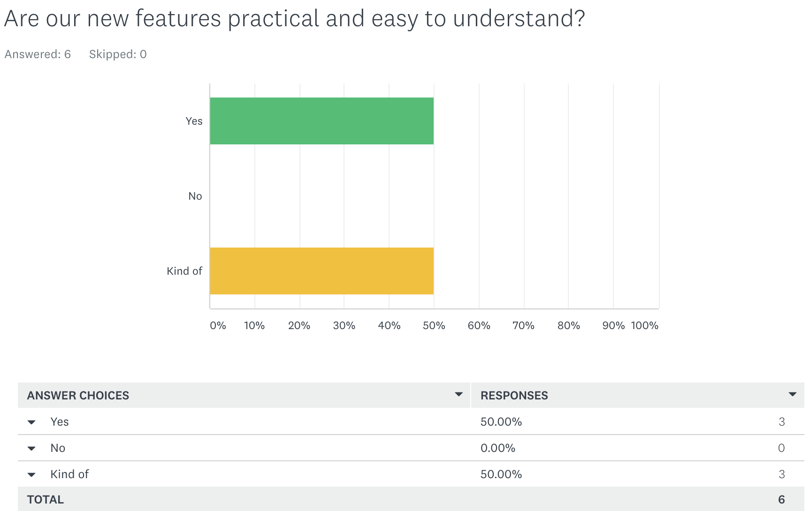
We reviewed our new features again regarding to whether they are easy to understand. 
Q2
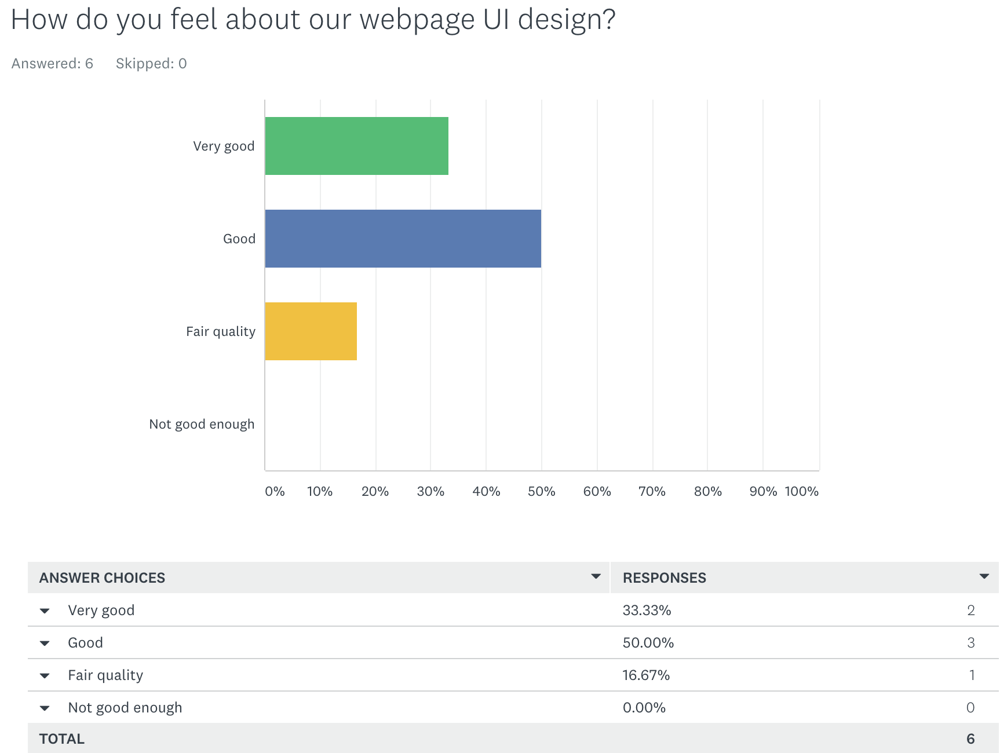
We did not change UI design too much as the feedback was quite positive.
Q3
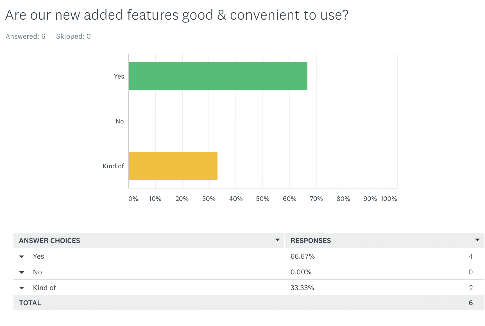
Q4
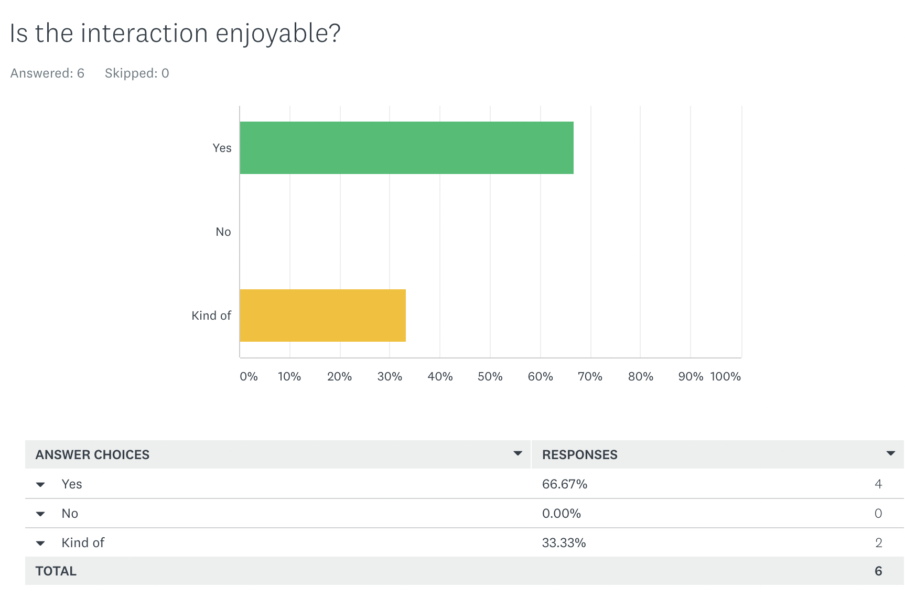
We are quite happy with Q3&Q4's feedback as that means we are on a right path. However we realized there are still places to improve and we asked that in Q7. 
Q5
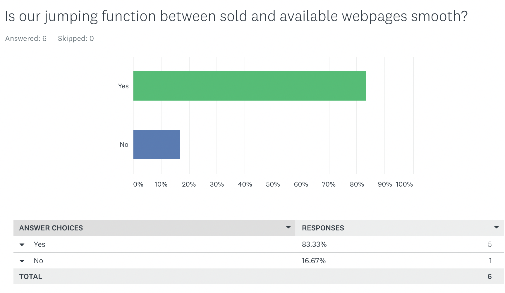
Q6
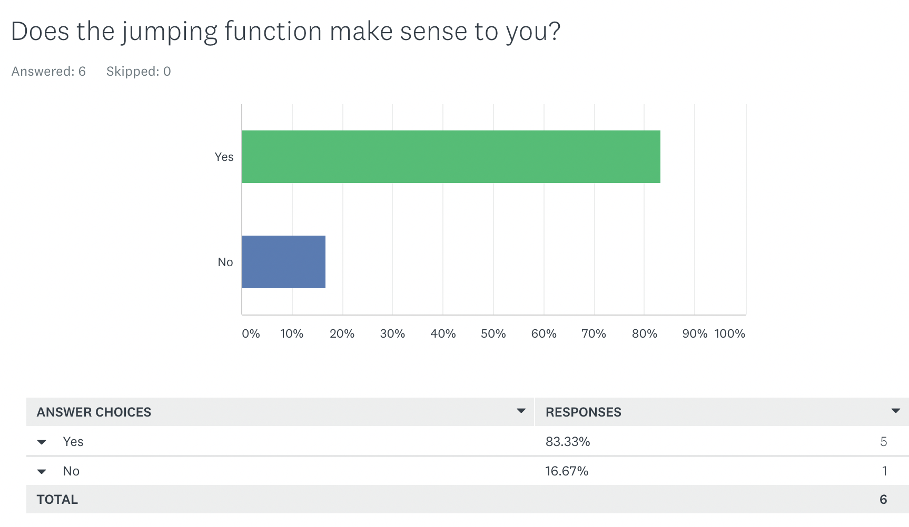
For Q5&Q6, we added more tips to the webpage as some feedback said they cannot identify which page is rank which page is available clearly. 
Q7
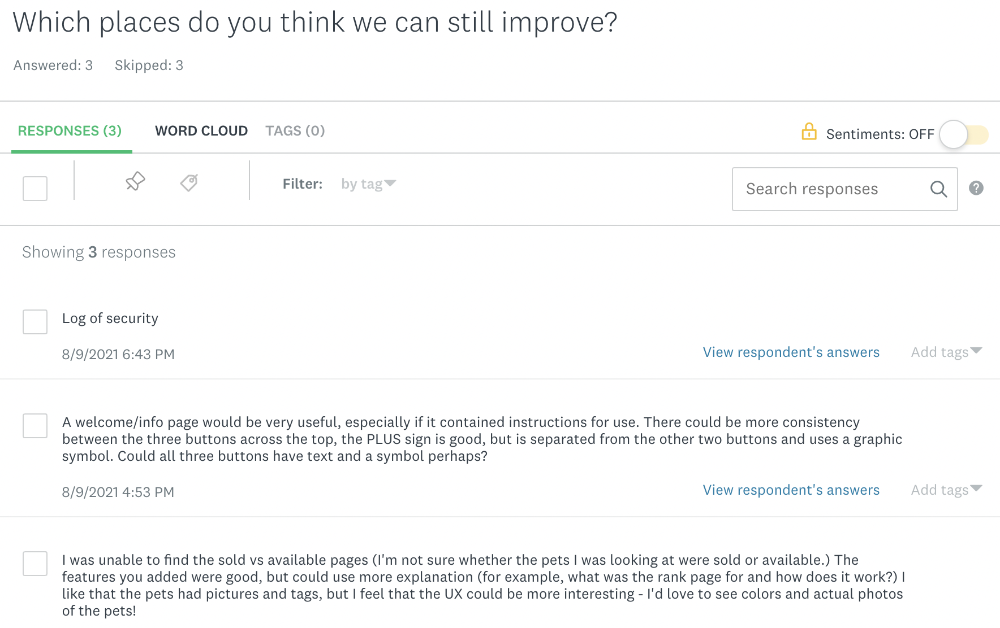
The feedback on this question is most meaningful to us. After seeing this, we decided to add tips and use actual pet pics. And we also discussed whether we are going to do a welcome page or not. As for buttons, we also agree with the idea that consistency needs to be improved so we modified the buttons as well. All the modification is described in UX development before. 
