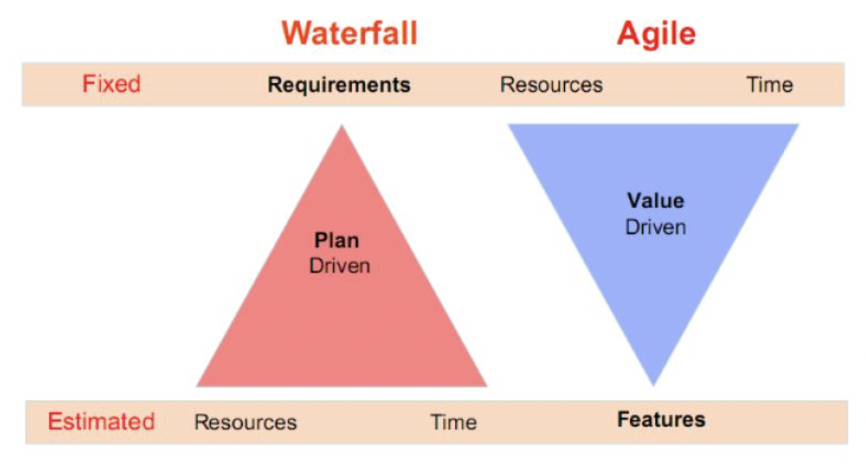
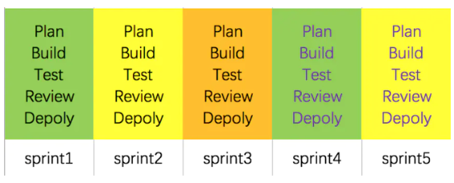
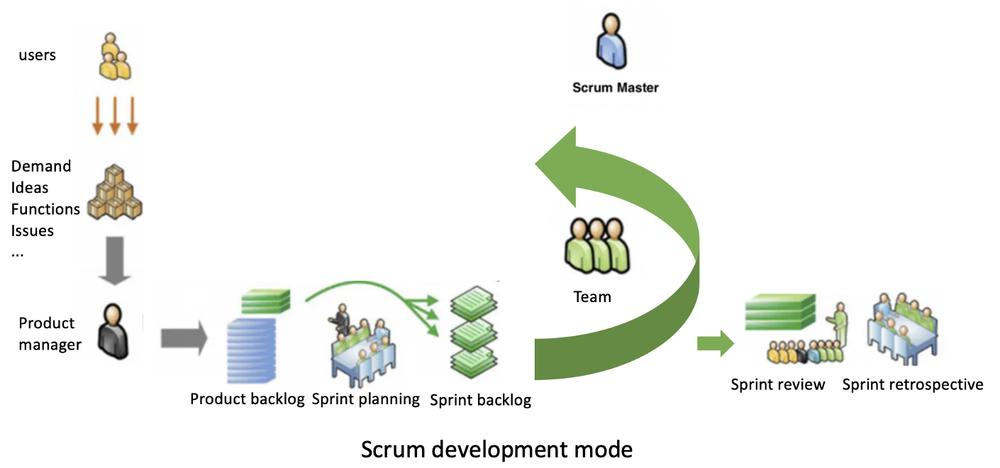

# Group Working Methods
Agile software development focuses on people and realizes quick delivery of software through iterative modification. It works well in dealing with complex system. There are many different styles of agile, including scrum, crystal, feature driven development, lean software development, XP extreme programming, Kanban and so forth. Our team utilized a combination of scrum development and feature driven development since that our main object is focusing on adding new features.  
This flexible development method helps us a lot as the demand for features change very quickly. As for our first three meetings, potential features change a lot during each meeting. Therefore, we must transform from waterfall to agile development mode which focuses on “Fix time, Flex Scope”.




We hold meetings via Teams roughly every 3 days. For every meeting, we update our progress first and then discuss the change of features and demand. Later on we iterate the new needs and make plan on fulfilling the new needs. All team member can bring up new thoughts and share issues in our webpage. Then all members can brainstorm and solve these issues together. At the meantime, we would review and measure the sprint for each stage and brainstorm modification. 



To better implement scrum, we have strict time limit for every task and all follow the timeline in Sprint part below. Scrum development links rules, tasks with roles and specific people. The person who is responsible for feature design would list things needs to be done first and rank their priority. Later on all team member would work on these tasks and work for sprints at the same time. 
With Scrum development, we can quickly adjust potential changes to features and user demand. We distribute the tasks and clarify the roles from the very beginning. Even when the actual coding for front end part have not started, we have assigned people to learn testing and do testing plan first. Under this case, as soon as the actual coding finishes, the testing can begin immediately, thus improving the overall efficiency. 
Apart from Scrum, we also combined feature driven development into the development mode. For each short term sprint, we make objectives and plans based on features we want to fulfill. 
Agile development also focuses on people and it is human driven. It requires sufficient team empowerment, motivation, align constraints, develop competence and grow structure. 
The process should be adaptive and flexible and always have other options ready to be used. When demand changes, the team can then quickly switch to plan B and rebuild certain features. 

# Team Roles

Zejia Liu: coding and implementation of features; report part “Use of git” writing
Jian Chen: Features designing, reflecting; report part “Features” writing
Hengbin An: Conclusion & Presentation 
Tramell Li: Process & user research & meeting records 
Tao He: Background & research 
All team members participate in the brainstorming and designing of features. 


# Sprints
Documentation of your sprints, including both high level overview, timeline, and selected highlights that were critical points in the project (remember to show the users stories implemented in each sprint). We expect a summary of meeting logs (including for instance apologies for absence etc)
High level overview: For quick in time justification of our webpage to cater to quick feature design and demand changes, our sprints are designed to be very short term and we nearly have a new sprint for each meeting every three days. 
### Timeline: grant chart/sprint backlog


### Critical points:
Early form of webpage basic 

# Continuous Integration
### branch
Every time we meet, a new RELEASE branch is created with the current date. For example, if today is 2021/07/27, then we would create a release-20210727 branch

### pull code
Choose the latest branch to develop on, not the main

### merge into main
Before each meeting, zejia liu will merge the code on the latest release branch into main, and after the meeting a new release branch will be created

### work space
As some students are not familiar with git, we will create a workspace directory and each student can only modify the contents of their own directory to prevent merging conflicts

### commit
We should have used eslint as the specification for the submission, but for convenience we just made our own stipulations. The stipulation is as follows:
```
   //for change the origion content:
   fix: {content}

   //for summit new contents:
   feat: {content}
```
