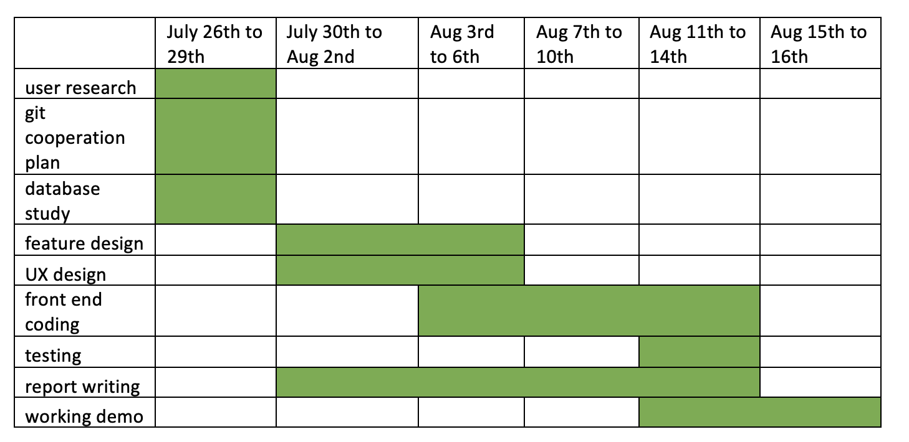

# Process

## Table of contents

- [Group working methods](#jump1)
- [Team roles](#jump2)
- [Documentation of sprints](#jump3)
- [Meeting logs](#jump4)
- [Use of git](#jump5)


## <span id="jump1">Group working methods</span>

Agile software development focuses on people and realizes quick delivery of software through iterative modification. It works well in dealing with complex system. There are many different styles of agile, including scrum, crystal, feature driven development, lean software development, XP extreme programming, Kanban and so forth. Our team utilized a combination of scrum development and feature driven development since that our main object is focusing on adding new features.  
This flexible development method helps us a lot as the demand for features change very quickly. As for our first three meetings, potential features change a lot during each meeting. Therefore, we must transform from waterfall to agile development mode which focuses on “Fix time, Flex Scope”.


We hold meetings via Teams roughly every 3 days. For every meeting, we update our progress first and then discuss the change of features and demand. Later on we iterate the new needs and make plan on fulfilling the new needs. All team member can bring up new thoughts and share issues in our webpage. Then all members can brainstorm and solve these issues together. At the meantime, we would review and measure the sprint for each stage and brainstorm modification. 


To better implement scrum, we have strict time limit for every task and all follow the timeline in Sprint part below. Scrum development links rules, tasks with roles and specific people. The person who is responsible for feature design would list things needs to be done first and rank their priority. Later on all team member would work on these tasks and work for sprints at the same time. 
With Scrum development, we can quickly adjust potential changes to features and user demand. We distribute the tasks and clarify the roles from the very beginning. Even when the actual coding for front end part have not started, we have assigned people to learn testing and do testing plan first. Under this case, as soon as the actual coding finishes, the testing can begin immediately, thus improving the overall efficiency. 

In addition, the transparency has also improved under Scrum as all people can know one member's work and progress. This development mode can help keep everyone concentrate on the project and  contribute to the sprint everyday. 

Apart from Scrum, we also combined feature driven development into the development mode. For each short term sprint, we make objectives and plans based on features we want to fulfill. 
Agile development also focuses on people and it is human driven. It requires sufficient team empowerment, motivation, align constraints, develop competence and grow structure. 
The process should be adaptive and flexible and always have other options ready to be used. When demand changes, the team can then quickly switch to plan B and rebuild certain features. 

## <span id="jump2">Team roles</span>

Zejia Liu: coding and implementation of features; report part “Use of git” writing

Jian Chen: Features designing, reflecting; report part “Features” writing

Hengbin An: Conclusion & Presentation 

Tramell Li: Process & user research & meeting records 

Tao He: Background & research 

All team members participate in the brainstorming and designing of features. 

## <span id="jump3">Documentation of sprints</span>

### Timeline: grant chart/sprint backlog



### Critical points:

1. Early form of webpage basic 
 
 This version came out after our first meeting when we roughly talked about some potential features and developers tried to implement them then, 


2. Version with full features 
 
 This version came out after the third meeting during which we finally decided on which features we were going to add. Our design changed a lot from the first meeting to the third. This sprint shows how we improved our design from the previous one. 
 


3. Beautified with CSS
 
 Version after putting on CSS:


4. Modified after HCI evaluation
 
 After analysing HCI feedback, we realized that our webpage might only make sense to ourselves and for other people it looked a little bit confusing. Therefore we discussed during forth meeting and decided to add some explanation and tips on the webpage to make it clearer. 


## <span id="jump4">Meeting logs</span>
### Meeting log 1
### Date: 2021 July 27th
### Attendance
Zejia Liu; Jian Chen; Hengbin An; Tramell Li.
### Absence
* Tao He (The meeting was organized provisionally while Tao was outside at that moment)
### Discussion
1. Potential features to be added:
* Find pet by categories (e.g. dog, cat, rabbit, hamster)
* Add pet pictures & add new pets 
* Filter function: e.g. filter by tags (pets characteristics e.g. outgoing, energetic, big, brave, docile, clever……)
* Ranking function: e.g. rank by popularity (number of times purchased), price 

2. Go through the APIs and database. See which APIs we could use and link API to our designed features. See which features we cannot realize based on the backend materials. For instance, there is no price in database so we might not be able to add the feature of ranking by price. 
3. Discuss whether this webpage is shown to customers or pet shop owner? Designed in benefits for shop owner or consumers?
4.  Cooperation method: Git & Github    release branch 
Github: workspace we each upload our work to folder named after our names under workspace folder. Tell Zejia what we uploaded during each meeting and he will merger useful things to final report sector in main branch.

5. The current database structure is not very ideal. Maybe we can add our own tags and pictures in through POST API later on.

6.   Assign each one’s work.

7. Time plan: finish all the designing, coding & report writing in two weeks and leave the last week to modify, do testing and improve. 

### Meeting log 2
### Date: 2021 July 29th
### Attendance
Zejia Liu; Jian Chen; Hengbin An; Tramell Li; Tao He.

### Discussion:
1. Update each one’s progress now and the web building process. Zejia showed us the early form of our web. Main page: search bar on the top with pets pictures listed below.
2. Clarify and discuss features again: shop owner can add or modify status of the pets. For the sold webpage, we can do a ranking which ranks the popularity of different categories. This aims at stimulate purchase. 
3. Jump function between sold page and search page: If user find some categories they like in sold page they can click on the link and be directed to pets under that category in available items.
4. Discuss the reason for setting ID as must fill in: ID has not been set as primary key in the database. We designed that to be self-increasing but not we need to insert ID by hand. 
5. Some other details on the webpage: footnotes, the photos of cats and dogs.
6. Discuss common web building process and why we do not add “others” in categories or tags. Categories and tags should be pre-defined.
7. Discuss the final presentation mode and if we can do the log in system & real time log in during the video presentation. 

### Meeting log 3
### Date: 2021 August 3rd
### Attendance
Zejia Liu; Jian Chen; Hengbin An; Tramell Li; Tao He.

### Discussion:
1.    Development progress update: features coding all done, only CSS and pictures left for the webpage.
2.    Discuss everyone’s contents for report.
3.    Discuss ID feature. Currently we set the prefix of ID.
4.    Discuss some potential modification to features, discuss their practicability. 
5.    Clarify again which features we brought out could be realized and which need to be put into future plan.
6.    Users have status e.g. 1 means commander and other number mean consumers. 

### Meeting log 4
### Date: 2021 August 7th 
### Attendance
Zejia Liu; Jian Chen; Hengbin An; Tramell Li; Tao He.
### Discussion:
1.    Testing: unit testing  tool: jest

(1)    test the return of addPet function

(2)    test the return of modifying status function: test if it matches our just modified status

2.    Integration testing: cypress   Developer explained what each integration testing does. 

Compare whether the webpage is accurate and the whether the url is right. 

Jumping between webpages needs to use integration testing to test. 

3.    Explained that the ranking is not stable as the back-end is unstable. 

4.    Update everyone’s progress on their report writing and discuss where we can improve.

5.    Delete function can add an alert to make it clearer. 

### Meeting log 5
### Date: 2021 August 10th 
### Attendance
Zejia Liu; Jian Chen; Hengbin An; Tramell Li; Tao He.
### Discussion:
1.    Testing: talk about whether we need another testing  

2.    Talked about jump function and modified the code together. 

3.    Reviewed the HCI evaluation feedback and discussed if we need further change according to the feedback. 

4.    Go through the report together. Talk about the logic of report and discuss the order of components in report. Talk about different levels of titles. 

### Meeting log 6
### Date: 2021 August 13th 
### Attendance
Zejia Liu; Jian Chen; Hengbin An; Tramell Li; Tao He.
### Discussion:
1.    We went through each person’s part from beginning to end and we modified them together. 

2.    We decided that everyone modify their parts individually. 

3.    Discussed about the sub-titles.

4.    Decided on how & when we are going to submit the assignment.


## <span id="jump5">Use of git</span>

### branch
Every time we meet, a new RELEASE branch is created with the current date. For example, if today is 2021/07/27, then we would create a release-20210727 branch. We git push things to this branch first and then one person is in charge of merging useful information to main branch. 

### pull code
We choose the latest branch to develop on, not the main. 

### merge into main
Before each meeting, zejia liu will merge the code on the latest release branch into main, and after the meeting a new release branch will be created. 

### workSpace
To avoid potential merging conflicts, we will create a workSpace directory and each member can only modify the contents in their own directory. 

### commit
We should have used eslint as the specification for the submission, but for convenience we just made our own stipulations. The stipulation is as follows:
```
   //for change the origion content:
   fix: {content}

   //for summit new contents:
   feat: {content}
```

## **References**

1.  Scrum.org (2021) WHAT IS SCRUM? [Online] Available from: <https://www.scrum.org/resources/what-is-scrum>.
2.  Sylvanns, D. (2021) 7 Different Types Of Agile Methodologies. [Online] Available from: <https://www.itbriefcase.net/7-different-types-of-agile-methodologies>.
